# 드론 마이크로도플러 아틀라스 — 보기 쉬운 판

> ⭐**먼저 볼 것 — [`00_since_deck.html`](00_since_deck.html) · 8/18 덱 이후에 한 실험 (한 장 색인)**
> 덱에 실린 데까지가 기준선이고, 그 뒤 **실험 30 건**이 무엇을 물어 무엇으로 답했는지를
> «물음 / 판정 / 근거 원장 / 볼 곳» 네 칸으로 한 장에 모았다.
> 이 갤러리의 어느 그림이 어느 실험의 답인지도 거기서 이어진다.

실험 원장에 쌓인 **팔 122 개 · 칸 349 개**를 두 종류의 그림 — **마이크로도플러 맵**과 **블레이드 대역 에너지** — 으로 전부 구워 놓은 갤러리다.

| 어디로 | 무엇 |
|---|---|
| [`00_since_deck.html`](00_since_deck.html) | ⭐**덱 이후 색인** — 실험 30 건 · 물음/판정/원장/볼 곳 · 아직 그림 없는 것 |
| [`index.html`](index.html) | **대문** — 읽는 법 · 주제 카드 9 장 · 이름 읽는 법 · 주의 |
| [`01_base.html`](01_base.html) | 세 엔진이 같은 드론을 어떻게 그리나 (팔 22 · 그림 49) |
| [`02_switch.html`](02_switch.html) | 어느 물리 스위치가 무늬를 바꾸나 (팔 38 · 그림 82) |
| [`03_airframe.html`](03_airframe.html) | 기체를 무늬로 가릴 수 있나 (팔 8 · 그림 19) |
| [`04_azimuth.html`](04_azimuth.html) | 드론이 돌면 어떻게 되나 (팔 14 · 그림 31) |
| [`05_parts.html`](05_parts.html) | 날개 신호는 어디서 오나 (팔 3 · 그림 8) |
| [`06_range.html`](06_range.html) | 멀어지면 어떻게 되나 (팔 30 · 그림 66) |
| [`07_ptd.html`](07_ptd.html) | 모서리 보정이 무늬를 바꾸나 (팔 4 · 그림 10) |
| [`08_grid.html`](08_grid.html) | 계산을 촘촘히 하면 답이 변하나 (팔 2 · 그림 6) |
| [`09_planewave.html`](09_planewave.html) | 파면 곡률이 결과를 바꾸나 (팔 1 · 그림 2) |

> 브라우저로 열려면 `atlas/index.html` 을 열면 된다(VSCode 에서 파일 우클릭 → «Open with Live Server» 또는 그냥 파일 두 번 클릭). 인터넷 없이 열린다 — CSS 가 파일 안에 들어 있고 그림은 저장소 안 상대경로다.

---

## 1. 이 그림들을 어떻게 읽나

**① 마이크로도플러 맵** — 가로가 **시간**, 세로가 **도플러 주파수**(움직이는 것 때문에 되돌아온 신호의 주파수가 밀린 양)다. 위줄은 받은 그대로, 아래줄은 **가만히 있는 부분(정지 성분)을 뺀** 판이다. 흰 점선이 **날개끝 상한** — 날개가 만들 수 있는 가장 빠른 도플러이고, 그 위에 무엇이 있으면 날개 말고 다른 것이다. **규칙적으로 되풀이되는 밝은 세로 줄무늬**가 날개가 시선을 지나갈 때의 번쩍임이다. ⚠패널마다 **자기 최댓값**으로 밝기를 맞추므로 패널끼리 밝기는 비교하지 않는다 — 모양만 읽는다.

**② 블레이드 대역 에너지** — 날개 대역 — 날개끝 상한의 **0.35~1.0 배** 띠(상한 **아래**다) — 의 힘이 시간에 따라 오르내리는 **리듬**을 주파수로 편 그림이다. 가로가 리듬의 빠르기[Hz], 세로가 그 세기다. **점선이 예측 박자의 정수배** — 점선 자리에 뾰족한 봉우리가 서면 날개가 그 박자로 규칙적으로 지나간다는 뜻이고, 봉우리 없이 뭉개져 있으면 그냥 잡음이다. 왼쪽은 넓게, 오른쪽은 첫 봉우리 부근을 확대한 판이다. 색은 앙각(위에서 내려다본 각)이다.

예시(`ours`):

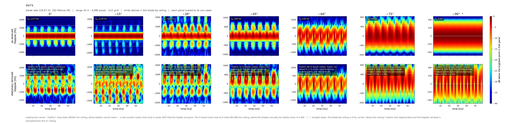

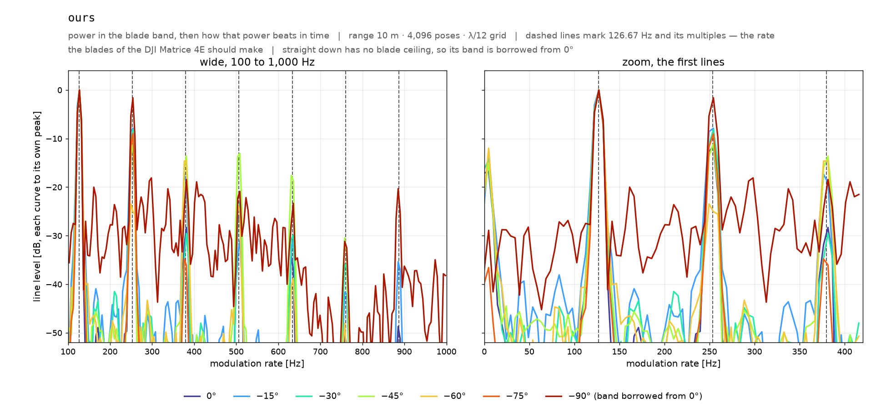

### 용어

| 말 | 뜻 |
|---|---|
| 도플러 | 움직이는 것에 맞고 되돌아온 신호의 주파수가 밀린 양[Hz]. 빠를수록 크다 |
| 박자(`f_flash`) | 날개가 시선을 지나가는 횟수[Hz] = 날개 수 × 회전수. 기체마다 다르다 |
| 날개끝 상한(`f_tip`) | 날개 **끝**이 만들 수 있는 가장 큰 도플러. 바로 아래(−90°)에서 0 |
| 리듬 몫[%] | 날개끝 상한 **«위»에** 남은 힘 중 박자의 정수배(±8 Hz)에 붙은 몫. ⛔**상한 위만 본다** — 날개 무늬가 상한 «아래»에 멀쩡히 있어도 0 % 가 나올 수 있다. 0 % 는 «리듬 없음» 이 아니라 «이 자리에선 못 읽음» 이다. 백색잡음 값은 팔마다 다르다 |
| 빗살 대비[dB] | ⭐리듬 몫의 **짝**. 상한 **아래**(날개가 실제로 사는 자리)에서 «정수배 자리 ÷ 그 사이 자리» 전력비. 백색잡음 0 dB. 두 수가 **함께** 널일 때만 «안 보인다» 고 말한다 |
| 정지 성분 제거 | 가만히 있는 부분(시간 평균)을 빼는 것. 레벨(dB)·리듬 몫·박자는 전부 정지 성분(시계열 평균) 제거 후에 잰다. |
| 앙각 | 얼마나 위에서 내려다보는가. 0° 옆에서 · −90° 바로 위에서 |
| 팔 | 조건 하나(엔진 · 거리 · 스위치 조합 …). 팔 이름이 곧 조건이다 |

### 그림을 만든 규약

- md\_mapstyle.flash\_spec — 블레이드 주기의 auto\_periods 배 조각 · hop 2 · 8× 제로패딩. 마이크로도플러 표현은 STFT 만 쓴다.
- 맵은 20 ms 부터 60 ms 창.
- ⚠기체 태그(\_mini5pro\_ 등)가 붙은 팔은 그 기체의 박자(날개수 × 호버rpm/60)로 잣대를 세운다. 원장 \_meta.f\_flash\_hz 는 기본 기체 값이라 그대로 쓰면 틀린다.
- ⚠앙각 −90° 는 f\_tip = 0 이라 «날개끝 상한 위» 잣대가 퇴화한다(tip\_ceiling\_degenerate). 대역은 0° 것을 빌린다(band\_borrowed\_from\_0deg).
- 기본값 — 주파수 3.5 GHz · 표본율 19700 Hz · 기본 기체 matrice4e · 기준 거리 15 m · 그림 구운 시각 2026-08-16 20:52 KST.

---

## 2. 주제 9 개

### 01. 세 엔진이 같은 드론을 어떻게 그리나

> 엔진(우리 커널 · Sionna PathSolver)과 광선 예산 · 자세 수를 갈아 끼운 판이다. ⚠<b>같은 자리가 아니다</b> — 이 주제 안에서 거리가 10 m 와 15 m 로 갈리고 (원거리장 경계 2D²/λ ≈ 14.08 m 를 가로지른다) 반사 깊이 · 물리 스위치도 함께 갈린다. 그래서 아래 헤드라인은 <b>거리를 맞춰서</b> 묶었다.

팔 22 개 · 칸 105 개 · 그림 49 장 · 페이지 [`01_base.html`](01_base.html)

**⭐ 핵심 발견**

- ⛔**이 주제는 아직 결론을 낼 수 없다** — 칸 1 개가 **자세가 덜 찬 상태**다(병합이 절반이다). 빈 자세 자리가 0 으로 채워져 있어서 그 0 채움이 스펙트럼을 PRF/2 · PRF/4 에 복제하고, 그 복제본이 «상한 위»를 삼켜 리듬 몫을 0 % 로 만든다 — 물리가 아니라 **결측 자국**이다. 그래서 그 칸에는 수를 싣지 않았다(`sionna_p4000000000` −75°). 원장을 다시 병합한 뒤에 읽어야 한다. 남은 읽을 수 있는 칸은 104 개다.
- ⚑**자세 하나가 헤드라인을 끄는 칸이 2 개** 있다 — `sionna_phys` −15°(자세 #3195) · `sionna_phys` −30°(자세 #2505). 가장 큰 자세 하나를 이웃 평균으로 갈아 끼우면 헤드라인이 그 앙각의 격자 산포 밴드 밖으로 움직인다. ⛔**버리라는 뜻이 아니다** — 그 자세가 진짜 정반사 플래시일 수도 있으니, 이 칸의 수를 근거로 쓰기 전에 그 자세를 열어 본다.
- ⌗**플래시가 한 표본 폭으로 찍힌 칸이 23 개** 있다 — 튐이 **아니라** 시간 분해능 문제다(참 신호가 표본 간격보다 좁다). 그 칸의 «상한 위 몫 · 빗살 대비»를 인용할 때는 그 단서를 함께 적는다.
- 앙각 −30° 에서 팔 21 개를 늘어놓으면 리듬 몫이 **12.4 %**(`sionna_p4000000000_phys_r15_n8192_d2`) 에서 **85.6 %**(`ours_r15_n32768`) 까지 벌어진다 — 폭 73.2 %p 는 격자 흔들림 밴드 21.8 %p 밖이라 **차이가 살아 있다**. ⚠양 끝 두 팔은 광선 예산 · 자세 수 · 반사 깊이도 다르다 — 이 폭을 «엔진 차이»로 읽으면 안 된다.
- 박자(날개가 시선을 지나가는 빠르기)를 잰 팔 22 개 중 **17 개**가 자기 기체의 예측 박자 ±2 % 안에 든다 — 나머지 5 개는 봉우리가 다른 자리에 섰다는 뜻이니 대역 그림에서 점선과 봉우리가 어긋났는지 본다.

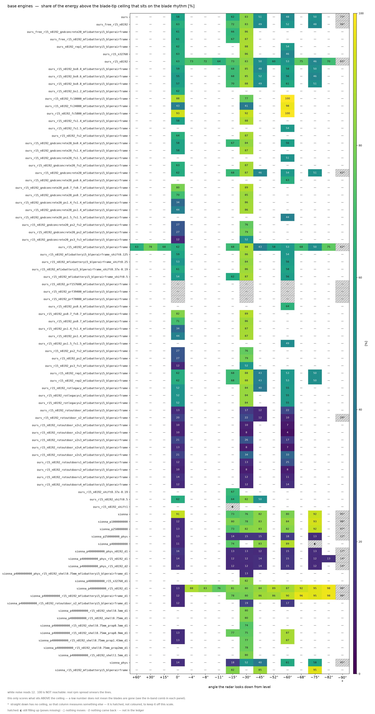

| 팔 | 무엇을 바꾼 판인가 | 앙각 | 리듬 몫[%] | 맵 · 대역 |
|---|---|---|---|---|
| `ours` | 엔진 **우리 커널**(SBR+PO, 가림 있음) · 거리 10 m · 자세 4,096 개 · 격자 λ/12 · 표적 DJI Matrice 4E · 박자 126.667 Hz | 0 −15 −30 −45 −60 −75 −90 | 58 62 83 51 48 50 73 | [맵](../outputs/figures/atlas/01base__ours__map.png) · [대역](../outputs/figures/atlas/01base__ours__band.png) |
| `ours_free_r15_n8192` | 엔진 **우리 커널**(동체 면을 빼 가림 없앤 대조군) · 거리 15 m · 자세 8,192 개 · 격자 λ/12 · 표적 DJI Matrice 4E · 박자 126.667 Hz | 0 −15 −30 −45 −60 −75 −90 | 63 72 83 49 52 48 56 | [맵](../outputs/figures/atlas/01base__ours_free_r15_n8192__map.png) · [대역](../outputs/figures/atlas/01base__ours_free_r15_n8192__band.png) |
| `ours_r15_n32768` | 엔진 **우리 커널**(SBR+PO, 가림 있음) · 거리 15 m · 자세 32,768 개 · 격자 λ/12 · 표적 DJI Matrice 4E · 박자 126.667 Hz | 0 −30 −60 | 63 86 46 | [맵](../outputs/figures/atlas/01base__ours_r15_n32768__map.png) · [대역](../outputs/figures/atlas/01base__ours_r15_n32768__band.png) |
| `ours_r15_n8192` | 엔진 **우리 커널**(SBR+PO, 가림 있음) · 거리 15 m · 자세 8,192 개 · 격자 λ/12 · 표적 DJI Matrice 4E · 박자 126.667 Hz | 0 −15 −30 −45 −60 −75 −90 | 63 73 83 50 53 46 65 | [맵](../outputs/figures/atlas/01base__ours_r15_n8192__map.png) · [대역](../outputs/figures/atlas/01base__ours_r15_n8192__band.png) |
| `sionna` | 엔진 **Sionna PathSolver** · 거리 10 m · 자세 4,096 개 · 광선 <span title="정확히 11,111,111 발">1,111 만 발</span> · 반사 깊이 1 · 스위치 물리 끔 · 표적 DJI Matrice 4E · 박자 126.667 Hz | 0 −15 −30 −45 −60 −75 −90 | 91 73 76 82 80 92 95 | [맵](../outputs/figures/atlas/01base__sionna__map.png) · [대역](../outputs/figures/atlas/01base__sionna__band.png) |
| `sionna_p1000000000` | 엔진 **Sionna PathSolver** · 거리 10 m · 자세 4,096 개 · 광선 <span title="정확히 1,000,000,000 발">10 억 발</span> · 반사 깊이 1 · 스위치 물리 끔 · 표적 DJI Matrice 4E · 박자 126.667 Hz | 0 −15 −30 −45 −60 −75 −90 | 12 80 78 83 84 93 98 | [맵](../outputs/figures/atlas/01base__sionna_p1000000000__map.png) · [대역](../outputs/figures/atlas/01base__sionna_p1000000000__band.png) |
| `sionna_p250000000` | 엔진 **Sionna PathSolver** · 거리 10 m · 자세 4,096 개 · 광선 <span title="정확히 250,000,000 발">2.5 억 발</span> · 반사 깊이 1 · 스위치 물리 끔 · 표적 DJI Matrice 4E · 박자 126.667 Hz | 0 −15 −30 −45 −60 −75 −90 | 13 73 82 83 82 92 97 | [맵](../outputs/figures/atlas/01base__sionna_p250000000__map.png) · [대역](../outputs/figures/atlas/01base__sionna_p250000000__band.png) |
| `sionna_p250000000_phys` | 엔진 **Sionna PathSolver** · 거리 10 m · 자세 4,096 개 · 광선 <span title="정확히 250,000,000 발">2.5 억 발</span> · 반사 깊이 3 · 스위치 물리 **전부 켬** · 표적 DJI Matrice 4E · 박자 126.667 Hz | 0 −15 −30 −45 −60 −75 −90 | 13 14 15 15 18 13 12 | [맵](../outputs/figures/atlas/01base__sionna_p250000000_phys__map.png) · [대역](../outputs/figures/atlas/01base__sionna_p250000000_phys__band.png) |
| `sionna_p4000000000` | 엔진 **Sionna PathSolver** · 거리 10 m · 자세 4,096 개 · 광선 <span title="정확히 4,000,000,000 발">40 억 발</span> · 반사 깊이 1 · 스위치 물리 끔 · 표적 DJI Matrice 4E · 박자 126.667 Hz | 0 −15 −45 −60 −75 | 11 74 83 89 — | [맵](../outputs/figures/atlas/01base__sionna_p4000000000__map.png) · [대역](../outputs/figures/atlas/01base__sionna_p4000000000__band.png) |
| `sionna_p4000000000_phys_n8192_d1` | 엔진 **Sionna PathSolver** · 거리 10 m · 자세 8,192 개 · 광선 <span title="정확히 4,000,000,000 발">40 억 발</span> · 반사 깊이 1 · 스위치 물리 **전부 켬** · 표적 DJI Matrice 4E · 박자 126.667 Hz | 0 −15 −30 −45 −60 −75 −90 | 16 13 13 12 15 13 17 | [맵](../outputs/figures/atlas/01base__sionna_p4000000000_phys_n8192_d1__map.png) · [대역](../outputs/figures/atlas/01base__sionna_p4000000000_phys_n8192_d1__band.png) |
| `sionna_p4000000000_phys_r15_n8192_d1` | 엔진 **Sionna PathSolver** · 거리 15 m · 자세 8,192 개 · 광선 <span title="정확히 4,000,000,000 발">40 억 발</span> · 반사 깊이 1 · 스위치 물리 **전부 켬** · 표적 DJI Matrice 4E · 박자 126.667 Hz | 0 −15 −30 −45 −60 −75 −90 | 14 12 12 14 15 12 14 | [맵](../outputs/figures/atlas/01base__sionna_p4000000000_phys_r15_n8192_d1__map.png) · [대역](../outputs/figures/atlas/01base__sionna_p4000000000_phys_r15_n8192_d1__band.png) |
| `sionna_p4000000000_phys_r15_n8192_d2` | 엔진 **Sionna PathSolver** · 거리 15 m · 자세 8,192 개 · 광선 <span title="정확히 4,000,000,000 발">40 억 발</span> · 반사 깊이 2 · 스위치 물리 **전부 켬** · 표적 DJI Matrice 4E · 박자 126.667 Hz | 0 −15 −30 −45 −60 −75 −90 | 14 12 12 14 15 12 14 | [맵](../outputs/figures/atlas/01base__sionna_p4000000000_phys_r15_n8192_d2__map.png) · [대역](../outputs/figures/atlas/01base__sionna_p4000000000_phys_r15_n8192_d2__band.png) |
| `sionna_p4000000000_r15_n32768_d1` | 엔진 **Sionna PathSolver** · 거리 15 m · 자세 32,768 개 · 광선 <span title="정확히 4,000,000,000 발">40 억 발</span> · 반사 깊이 1 · 스위치 물리 끔 · 표적 DJI Matrice 4E · 박자 126.667 Hz | −30 | 82 | [맵](../outputs/figures/atlas/01base__sionna_p4000000000_r15_n32768_d1__map.png) · [대역](../outputs/figures/atlas/01base__sionna_p4000000000_r15_n32768_d1__band.png) |
| `sionna_p4000000000_r15_n8192_d1` | 엔진 **Sionna PathSolver** · 거리 15 m · 자세 8,192 개 · 광선 <span title="정확히 4,000,000,000 발">40 억 발</span> · 반사 깊이 1 · 스위치 물리 끔 · 표적 DJI Matrice 4E · 박자 126.667 Hz | 0 −15 −30 −45 −60 −75 −90 | 13 81 80 84 87 95 98 | [맵](../outputs/figures/atlas/01base__sionna_p4000000000_r15_n8192_d1__map.png) · [대역](../outputs/figures/atlas/01base__sionna_p4000000000_r15_n8192_d1__band.png) |
| `sionna_p4000000000_r15_n8192_shell0.5mm_d1` | 엔진 **Sionna PathSolver** · 거리 15 m · 자세 8,192 개 · 광선 <span title="정확히 4,000,000,000 발">40 억 발</span> · 반사 깊이 1 · 스위치 물리 끔 · 표적 DJI Matrice 4E · 박자 126.667 Hz | −30 | 80 | [맵](../outputs/figures/atlas/01base__sionna_p4000000000_r15_n8192_shell0.5mm_d1__map.png) · [대역](../outputs/figures/atlas/01base__sionna_p4000000000_r15_n8192_shell0.5mm_d1__band.png) |
| `sionna_p4000000000_r15_n8192_shell0.75mm_d1` | 엔진 **Sionna PathSolver** · 거리 15 m · 자세 8,192 개 · 광선 <span title="정확히 4,000,000,000 발">40 억 발</span> · 반사 깊이 1 · 스위치 물리 끔 · 표적 DJI Matrice 4E · 박자 126.667 Hz | −30 | 80 | [맵](../outputs/figures/atlas/01base__sionna_p4000000000_r15_n8192_shell0.75mm_d1__map.png) · [대역](../outputs/figures/atlas/01base__sionna_p4000000000_r15_n8192_shell0.75mm_d1__band.png) |
| `sionna_p4000000000_r15_n8192_shell0.75mm_prop0.5mm_d1` | 엔진 **Sionna PathSolver** · 거리 15 m · 자세 8,192 개 · 광선 <span title="정확히 4,000,000,000 발">40 억 발</span> · 반사 깊이 1 · 스위치 물리 끔 · 표적 DJI Matrice 4E · 박자 126.667 Hz | −30 | 74 | [맵](../outputs/figures/atlas/01base__sionna_p4000000000_r15_n8192_shell0.75mm_prop0.5mm_d1__map.png) · [대역](../outputs/figures/atlas/01base__sionna_p4000000000_r15_n8192_shell0.75mm_prop0.5mm_d1__band.png) |
| `sionna_p4000000000_r15_n8192_shell0.75mm_prop0.9mm_d1` | 엔진 **Sionna PathSolver** · 거리 15 m · 자세 8,192 개 · 광선 <span title="정확히 4,000,000,000 발">40 억 발</span> · 반사 깊이 1 · 스위치 물리 끔 · 표적 DJI Matrice 4E · 박자 126.667 Hz | 0 −15 −30 −60 | 13 77 75 87 | [맵](../outputs/figures/atlas/01base__sionna_p4000000000_r15_n8192_shell0.75mm_prop0.9mm_d1__map.png) · [대역](../outputs/figures/atlas/01base__sionna_p4000000000_r15_n8192_shell0.75mm_prop0.9mm_d1__band.png) |
| `sionna_p4000000000_r15_n8192_shell0.75mm_prop1.43mm_d1` | 엔진 **Sionna PathSolver** · 거리 15 m · 자세 8,192 개 · 광선 <span title="정확히 4,000,000,000 발">40 억 발</span> · 반사 깊이 1 · 스위치 물리 끔 · 표적 DJI Matrice 4E · 박자 126.667 Hz | 0 −30 −60 | 13 77 87 | [맵](../outputs/figures/atlas/01base__sionna_p4000000000_r15_n8192_shell0.75mm_prop1.43mm_d1__map.png) · [대역](../outputs/figures/atlas/01base__sionna_p4000000000_r15_n8192_shell0.75mm_prop1.43mm_d1__band.png) |
| `sionna_p4000000000_r15_n8192_shell0.75mm_prop2mm_d1` | 엔진 **Sionna PathSolver** · 거리 15 m · 자세 8,192 개 · 광선 <span title="정확히 4,000,000,000 발">40 억 발</span> · 반사 깊이 1 · 스위치 물리 끔 · 표적 DJI Matrice 4E · 박자 126.667 Hz | −30 | 78 | [맵](../outputs/figures/atlas/01base__sionna_p4000000000_r15_n8192_shell0.75mm_prop2mm_d1__map.png) · [대역](../outputs/figures/atlas/01base__sionna_p4000000000_r15_n8192_shell0.75mm_prop2mm_d1__band.png) |
| `sionna_p4000000000_r15_n8192_shell1.5mm_d1` | 엔진 **Sionna PathSolver** · 거리 15 m · 자세 8,192 개 · 광선 <span title="정확히 4,000,000,000 발">40 억 발</span> · 반사 깊이 1 · 스위치 물리 끔 · 표적 DJI Matrice 4E · 박자 126.667 Hz | −30 | 80 | [맵](../outputs/figures/atlas/01base__sionna_p4000000000_r15_n8192_shell1.5mm_d1__map.png) · [대역](../outputs/figures/atlas/01base__sionna_p4000000000_r15_n8192_shell1.5mm_d1__band.png) |
| `sionna_phys` | 엔진 **Sionna PathSolver** · 거리 10 m · 자세 4,096 개 · 광선 <span title="정확히 11,111,111 발">1,111 만 발</span> · 반사 깊이 3 · 스위치 물리 **전부 켬** · 표적 DJI Matrice 4E · 박자 126.667 Hz | 0 −15 −30 −45 −60 −75 −90 | 14 18 52 40 61 58 45 | [맵](../outputs/figures/atlas/01base__sionna_phys__map.png) · [대역](../outputs/figures/atlas/01base__sionna_phys__band.png) |

### 02. 어느 물리 스위치가 무늬를 바꾸나

> 굴절 · 회절 · 모서리 회절 · 확산 반사를 하나씩 켜고 끈 판이다. 무엇을 켜면 날개 리듬이 살아나고 무엇을 끄면 주저앉는지를 한 축씩 본다.

팔 38 개 · 칸 83 개 · 그림 82 장 · 페이지 [`02_switch.html`](02_switch.html)

**⭐ 핵심 발견**

- ⚑**자세 하나가 헤드라인을 끄는 칸이 1 개** 있다 — `sionna_p4000000000_onlydepth3_r15_n8192` −60°(자세 #3399). 가장 큰 자세 하나를 이웃 평균으로 갈아 끼우면 헤드라인이 그 앙각의 격자 산포 밴드 밖으로 움직인다. ⛔**버리라는 뜻이 아니다** — 그 자세가 진짜 정반사 플래시일 수도 있으니, 이 칸의 수를 근거로 쓰기 전에 그 자세를 열어 본다.
- ⌗**플래시가 한 표본 폭으로 찍힌 칸이 10 개** 있다 — 튐이 **아니라** 시간 분해능 문제다(참 신호가 표본 간격보다 좁다). 그 칸의 «상한 위 몫 · 빗살 대비»를 인용할 때는 그 단서를 함께 적는다.
- 앙각 −30° 에서 팔 32 개를 늘어놓으면 리듬 몫이 **11.2 %**(`sionna_p4000000000_swR0D1E0F0_r15_n8192_d3`) 에서 **80.6 %**(`sionna_p4000000000_onlydepth3_r15_n8192`) 까지 벌어진다 — 폭 69.4 %p 는 격자 흔들림 밴드 21.8 %p 밖이라 **차이가 살아 있다**.
- 박자(날개가 시선을 지나가는 빠르기)를 잰 팔 34 개 중 **16 개**가 자기 기체의 예측 박자 ±2 % 안에 든다 — 나머지 18 개는 봉우리가 다른 자리에 섰다는 뜻이니 대역 그림에서 점선과 봉우리가 어긋났는지 본다.
- 한 축만 다른 짝(`sionna_p4000000000_swR0D1E0F0_r15_n8192_d1` ↔ `sionna_p4000000000_r15_n8192_d1`)을 같은 앙각 1 칸에서 빼면 리듬 몫 차이가 가장 큰 곳이 **68.9 %p**(평균 -68.9 %p) — 격자 흔들림 밴드 21.8 %p 밖이라 **차이가 살아 있다**. ⭐짝이 있는 팔은 8 개인데 그중 밴드 밖은 **8 개**다 — 여기 적은 것은 그중 **가장 큰 한 짝**일 뿐이니 주제 전체의 결론으로 읽지 마라(팔마다 링크를 달아 두었다).

**⭐ 반사 깊이 축 — 깊이 1 과 깊이 3 이 같은 것을 읽나** (8/18 덱 «Future work» 1 번)

짝 22 개(깊이 1↔3 15 · 1↔2 7)를 전수 조사한 판정: **우리 규약(깊이 1)에 대해서는 닫히고, 축 전체로는 아직 안 닫힌다.**

- **닫힌 것** — 표준 프레임 두 팔의 깊이 짝 7 개 전부 리듬 몫 차 **≤0.40 %p**, 빗각·거리 5 칸에서 빗살 대비 차 **≤0.21 dB**. 큐에서 깊이 3 을 표준 팔에 다시 태울 이유가 없다.
- **안 닫힌 것** — 회절 켠 조합에서 깊이 3 이 요동 절대전력을 **+1.32~+2.33 dB** 올린다(−30° 밴드 0.37 dB 의 4~6 배). 그 팔의 절대 레벨 인용에는 «깊이 1 한정» 꼬리표가 필요하다.
- ⛔**철회** — «−60° 에서 깊이 3 이 리듬을 무너뜨린다»(08-15)는 자세 8,192 개 중 하나(#3399) 때문이었다. `outputs/switch_factorial.json` 의 `B_failures` 첫 줄은 인용 금지.

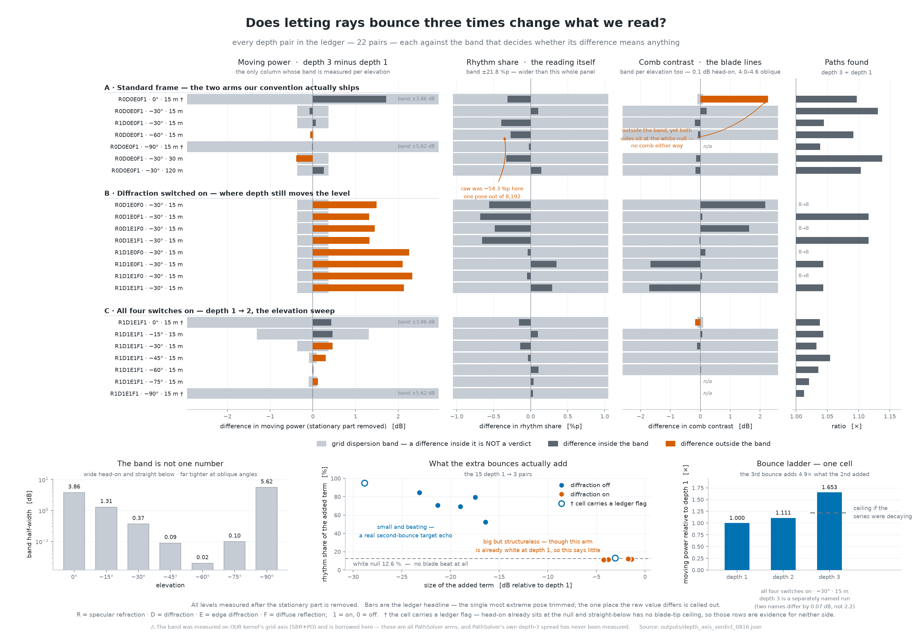

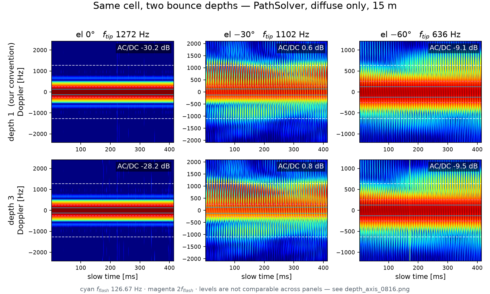

원장 `outputs/depth_axis_verdict_0816.json` · 재생성 `benchmark/build_depth_axis_fig.py`


| 팔 | 무엇을 바꾼 판인가 | 앙각 | 리듬 몫[%] | 맵 · 대역 |
|---|---|---|---|---|
| `sionna_p4000000000_onlydepth3_r15_n8192` | 엔진 **Sionna PathSolver** · 거리 15 m · 자세 8,192 개 · 광선 <span title="정확히 4,000,000,000 발">40 억 발</span> · 반사 깊이 3 · 스위치 깊이 3 만 켬 · 표적 DJI Matrice 4E · 박자 126.667 Hz | 0 −30 −60 −90 | 13 81 32 98 | [맵](../outputs/figures/atlas/02switch__sionna_p4000000000_onlydepth3_r15_n8192__map.png) · [대역](../outputs/figures/atlas/02switch__sionna_p4000000000_onlydepth3_r15_n8192__band.png) |
| `sionna_p4000000000_onlydiffr_r15_n8192` | 엔진 **Sionna PathSolver** · 거리 15 m · 자세 8,192 개 · 광선 <span title="정확히 4,000,000,000 발">40 억 발</span> · 반사 깊이 1 · 스위치 회절만 켬 · 표적 DJI Matrice 4E · 박자 126.667 Hz | 0 −15 −30 −45 −60 −75 −90 | 14 12 12 13 14 13 13 | [맵](../outputs/figures/atlas/02switch__sionna_p4000000000_onlydiffr_r15_n8192__map.png) · [대역](../outputs/figures/atlas/02switch__sionna_p4000000000_onlydiffr_r15_n8192__band.png) |
| `sionna_p4000000000_onlyedge_r15_n8192` | 엔진 **Sionna PathSolver** · 거리 15 m · 자세 8,192 개 · 광선 <span title="정확히 4,000,000,000 발">40 억 발</span> · 반사 깊이 1 · 스위치 모서리 회절만 켬 · 표적 DJI Matrice 4E · 박자 126.667 Hz | 0 −30 −60 −90 | 13 80 87 98 | [맵](../outputs/figures/atlas/02switch__sionna_p4000000000_onlyedge_r15_n8192__map.png) · [대역](../outputs/figures/atlas/02switch__sionna_p4000000000_onlyedge_r15_n8192__band.png) |
| `sionna_p4000000000_onlyrefr_mini5pro_r15_n8192` | 엔진 **Sionna PathSolver** · 거리 15 m · 자세 8,192 개 · 광선 <span title="정확히 4,000,000,000 발">40 억 발</span> · 반사 깊이 1 · 스위치 굴절만 켬 · 표적 DJI Mini 5 Pro(**기체 태그**) · 박자 183.333 Hz | 0 −30 −60 | 9 71 59 | [맵](../outputs/figures/atlas/02switch__sionna_p4000000000_onlyrefr_mini5pro_r15_n8192__map.png) · [대역](../outputs/figures/atlas/02switch__sionna_p4000000000_onlyrefr_mini5pro_r15_n8192__band.png) |
| `sionna_p4000000000_onlyrefr_partsnoprop_r15_n8192` | 엔진 **Sionna PathSolver** · 거리 15 m · 자세 8,192 개 · 광선 <span title="정확히 4,000,000,000 발">40 억 발</span> · 반사 깊이 1 · 스위치 굴절만 켬 · 장면 **프로펠러 뺀 나머지** · 표적 DJI Matrice 4E · 박자 126.667 Hz | 0 | — | [맵](../outputs/figures/atlas/02switch__sionna_p4000000000_onlyrefr_partsnoprop_r15_n8192__map.png) · [대역](../outputs/figures/atlas/02switch__sionna_p4000000000_onlyrefr_partsnoprop_r15_n8192__band.png) |
| `sionna_p4000000000_onlyrefr_partsprop_r15_n8192` | 엔진 **Sionna PathSolver** · 거리 15 m · 자세 8,192 개 · 광선 <span title="정확히 4,000,000,000 발">40 억 발</span> · 반사 깊이 1 · 스위치 굴절만 켬 · 장면 **프로펠러만** · 표적 DJI Matrice 4E · 박자 126.667 Hz | 0 | 53 | [맵](../outputs/figures/atlas/02switch__sionna_p4000000000_onlyrefr_partsprop_r15_n8192__map.png) · [대역](../outputs/figures/atlas/02switch__sionna_p4000000000_onlyrefr_partsprop_r15_n8192__band.png) |
| `sionna_p4000000000_onlyrefr_r120_n8192` | 엔진 **Sionna PathSolver** · 거리 120 m · 자세 8,192 개 · 광선 <span title="정확히 4,000,000,000 발">40 억 발</span> · 반사 깊이 1 · 스위치 굴절만 켬 · 표적 DJI Matrice 4E · 박자 126.667 Hz | 0 −30 | 44 66 | [맵](../outputs/figures/atlas/02switch__sionna_p4000000000_onlyrefr_r120_n8192__map.png) · [대역](../outputs/figures/atlas/02switch__sionna_p4000000000_onlyrefr_r120_n8192__band.png) |
| `sionna_p4000000000_onlyrefr_r15_n8192` | 엔진 **Sionna PathSolver** · 거리 15 m · 자세 8,192 개 · 광선 <span title="정확히 4,000,000,000 발">40 억 발</span> · 반사 깊이 1 · 스위치 굴절만 켬 · 표적 DJI Matrice 4E · 박자 126.667 Hz | 0 −15 −30 −45 −60 −75 −90 | 13 61 62 65 64 57 62 | [맵](../outputs/figures/atlas/02switch__sionna_p4000000000_onlyrefr_r15_n8192__map.png) · [대역](../outputs/figures/atlas/02switch__sionna_p4000000000_onlyrefr_r15_n8192__band.png) |
| `sionna_p4000000000_onlyrefr_r15_n8192_az22.5` | 엔진 **Sionna PathSolver** · 거리 15 m · 자세 8,192 개 · 광선 <span title="정확히 4,000,000,000 발">40 억 발</span> · 반사 깊이 1 · 스위치 굴절만 켬 · 방위 22.5° · 표적 DJI Matrice 4E · 박자 126.667 Hz | −30 | 65 | [맵](../outputs/figures/atlas/02switch__sionna_p4000000000_onlyrefr_r15_n8192_az22.5__map.png) · [대역](../outputs/figures/atlas/02switch__sionna_p4000000000_onlyrefr_r15_n8192_az22.5__band.png) |
| `sionna_p4000000000_onlyrefr_r15_n8192_az45` | 엔진 **Sionna PathSolver** · 거리 15 m · 자세 8,192 개 · 광선 <span title="정확히 4,000,000,000 발">40 억 발</span> · 반사 깊이 1 · 스위치 굴절만 켬 · 방위 45° · 표적 DJI Matrice 4E · 박자 126.667 Hz | −30 | 64 | [맵](../outputs/figures/atlas/02switch__sionna_p4000000000_onlyrefr_r15_n8192_az45__map.png) · [대역](../outputs/figures/atlas/02switch__sionna_p4000000000_onlyrefr_r15_n8192_az45__band.png) |
| `sionna_p4000000000_onlyrefr_r15_n8192_az67.5` | 엔진 **Sionna PathSolver** · 거리 15 m · 자세 8,192 개 · 광선 <span title="정확히 4,000,000,000 발">40 억 발</span> · 반사 깊이 1 · 스위치 굴절만 켬 · 방위 67.5° · 표적 DJI Matrice 4E · 박자 126.667 Hz | −30 | 64 | [맵](../outputs/figures/atlas/02switch__sionna_p4000000000_onlyrefr_r15_n8192_az67.5__map.png) · [대역](../outputs/figures/atlas/02switch__sionna_p4000000000_onlyrefr_r15_n8192_az67.5__band.png) |
| `sionna_p4000000000_onlyrefr_r15_n8192_shell0.75mm_prop0.9mm` | 엔진 **Sionna PathSolver** · 거리 15 m · 자세 8,192 개 · 광선 <span title="정확히 4,000,000,000 발">40 억 발</span> · 반사 깊이 1 · 스위치 굴절만 켬 · 표적 DJI Matrice 4E · 박자 126.667 Hz | 0 −30 | 12 40 | [맵](../outputs/figures/atlas/02switch__sionna_p4000000000_onlyrefr_r15_n8192_shell0.75mm_prop0.9mm__map.png) · [대역](../outputs/figures/atlas/02switch__sionna_p4000000000_onlyrefr_r15_n8192_shell0.75mm_prop0.9mm__band.png) |
| `sionna_p4000000000_onlyrefr_r15_n8192_shell0.75mm_prop1.43mm` | 엔진 **Sionna PathSolver** · 거리 15 m · 자세 8,192 개 · 광선 <span title="정확히 4,000,000,000 발">40 억 발</span> · 반사 깊이 1 · 스위치 굴절만 켬 · 표적 DJI Matrice 4E · 박자 126.667 Hz | −30 | 41 | [맵](../outputs/figures/atlas/02switch__sionna_p4000000000_onlyrefr_r15_n8192_shell0.75mm_prop1.43mm__map.png) · [대역](../outputs/figures/atlas/02switch__sionna_p4000000000_onlyrefr_r15_n8192_shell0.75mm_prop1.43mm__band.png) |
| `sionna_p4000000000_onlyrefr_r240_n8192` | 엔진 **Sionna PathSolver** · 거리 240 m · 자세 8,192 개 · 광선 <span title="정확히 4,000,000,000 발">40 억 발</span> · 반사 깊이 1 · 스위치 굴절만 켬 · 표적 DJI Matrice 4E · 박자 126.667 Hz | 0 −30 | 56 69 | [맵](../outputs/figures/atlas/02switch__sionna_p4000000000_onlyrefr_r240_n8192__map.png) · [대역](../outputs/figures/atlas/02switch__sionna_p4000000000_onlyrefr_r240_n8192__band.png) |
| `sionna_p4000000000_onlyrefr_r30_n8192` | 엔진 **Sionna PathSolver** · 거리 30 m · 자세 8,192 개 · 광선 <span title="정확히 4,000,000,000 발">40 억 발</span> · 반사 깊이 1 · 스위치 굴절만 켬 · 표적 DJI Matrice 4E · 박자 126.667 Hz | 0 −30 | 13 64 | [맵](../outputs/figures/atlas/02switch__sionna_p4000000000_onlyrefr_r30_n8192__map.png) · [대역](../outputs/figures/atlas/02switch__sionna_p4000000000_onlyrefr_r30_n8192__band.png) |
| `sionna_p4000000000_onlyrefr_r60_n8192` | 엔진 **Sionna PathSolver** · 거리 60 m · 자세 8,192 개 · 광선 <span title="정확히 4,000,000,000 발">40 억 발</span> · 반사 깊이 1 · 스위치 굴절만 켬 · 표적 DJI Matrice 4E · 박자 126.667 Hz | 0 −30 | 13 70 | [맵](../outputs/figures/atlas/02switch__sionna_p4000000000_onlyrefr_r60_n8192__map.png) · [대역](../outputs/figures/atlas/02switch__sionna_p4000000000_onlyrefr_r60_n8192__band.png) |
| `sionna_p4000000000_onlyrefr_s1000plus_r15_n8192` | 엔진 **Sionna PathSolver** · 거리 15 m · 자세 8,192 개 · 광선 <span title="정확히 4,000,000,000 발">40 억 발</span> · 반사 깊이 1 · 스위치 굴절만 켬 · 표적 DJI S1000+(**기체 태그**) · 박자 148.9 Hz | 0 −30 −60 | 30 36 66 | [맵](../outputs/figures/atlas/02switch__sionna_p4000000000_onlyrefr_s1000plus_r15_n8192__map.png) · [대역](../outputs/figures/atlas/02switch__sionna_p4000000000_onlyrefr_s1000plus_r15_n8192__band.png) |
| `sionna_p4000000000_stockdef_r15_n8192` | 엔진 **Sionna PathSolver** · 거리 15 m · 자세 8,192 개 · 광선 <span title="정확히 4,000,000,000 발">40 억 발</span> · 반사 깊이 3 · 스위치 **순정 기본값**(굴절만 켬 · 확산 끔) · 표적 DJI Matrice 4E · 박자 126.667 Hz | 0 −15 −30 −45 −60 −75 −90 | 13 — — — — — — | [맵](../outputs/figures/atlas/02switch__sionna_p4000000000_stockdef_r15_n8192__map.png) · [대역](../outputs/figures/atlas/02switch__sionna_p4000000000_stockdef_r15_n8192__band.png) |
| `sionna_p4000000000_swR0D0E0F0_r15_n8192_d1` | 엔진 **Sionna PathSolver** · 거리 15 m · 자세 8,192 개 · 광선 <span title="정확히 4,000,000,000 발">40 억 발</span> · 반사 깊이 1 · 스위치 **전부 끔** · 표적 DJI Matrice 4E · 박자 126.667 Hz | −30 | — | [맵](../outputs/figures/atlas/02switch__sionna_p4000000000_swR0D0E0F0_r15_n8192_d1__map.png) · [대역](../outputs/figures/atlas/02switch__sionna_p4000000000_swR0D0E0F0_r15_n8192_d1__band.png) |
| `sionna_p4000000000_swR0D0E0F0_r15_n8192_d3` | 엔진 **Sionna PathSolver** · 거리 15 m · 자세 8,192 개 · 광선 <span title="정확히 4,000,000,000 발">40 억 발</span> · 반사 깊이 3 · 스위치 **전부 끔** · 표적 DJI Matrice 4E · 박자 126.667 Hz | −30 | — | [맵](../outputs/figures/atlas/02switch__sionna_p4000000000_swR0D0E0F0_r15_n8192_d3__map.png) · [대역](../outputs/figures/atlas/02switch__sionna_p4000000000_swR0D0E0F0_r15_n8192_d3__band.png) |
| `sionna_p4000000000_swR0D1E0F0_r15_n8192_d1` | 엔진 **Sionna PathSolver** · 거리 15 m · 자세 8,192 개 · 광선 <span title="정확히 4,000,000,000 발">40 억 발</span> · 반사 깊이 1 · 스위치 회절 · 표적 DJI Matrice 4E · 박자 126.667 Hz | −30 | 12 | [맵](../outputs/figures/atlas/02switch__sionna_p4000000000_swR0D1E0F0_r15_n8192_d1__map.png) · [대역](../outputs/figures/atlas/02switch__sionna_p4000000000_swR0D1E0F0_r15_n8192_d1__band.png) |
| `sionna_p4000000000_swR0D1E0F0_r15_n8192_d3` | 엔진 **Sionna PathSolver** · 거리 15 m · 자세 8,192 개 · 광선 <span title="정확히 4,000,000,000 발">40 억 발</span> · 반사 깊이 3 · 스위치 회절 · 표적 DJI Matrice 4E · 박자 126.667 Hz | −30 | 11 | [맵](../outputs/figures/atlas/02switch__sionna_p4000000000_swR0D1E0F0_r15_n8192_d3__map.png) · [대역](../outputs/figures/atlas/02switch__sionna_p4000000000_swR0D1E0F0_r15_n8192_d3__band.png) |
| `sionna_p4000000000_swR0D1E0F1_r15_n8192_d3` | 엔진 **Sionna PathSolver** · 거리 15 m · 자세 8,192 개 · 광선 <span title="정확히 4,000,000,000 발">40 억 발</span> · 반사 깊이 3 · 스위치 회절 + 확산 반사 · 표적 DJI Matrice 4E · 박자 126.667 Hz | −30 | 11 | [맵](../outputs/figures/atlas/02switch__sionna_p4000000000_swR0D1E0F1_r15_n8192_d3__map.png) · [대역](../outputs/figures/atlas/02switch__sionna_p4000000000_swR0D1E0F1_r15_n8192_d3__band.png) |
| `sionna_p4000000000_swR0D1E1F0_r15_n8192_d1` | 엔진 **Sionna PathSolver** · 거리 15 m · 자세 8,192 개 · 광선 <span title="정확히 4,000,000,000 발">40 억 발</span> · 반사 깊이 1 · 스위치 회절 + 모서리 회절 · 표적 DJI Matrice 4E · 박자 126.667 Hz | −30 | 12 | [맵](../outputs/figures/atlas/02switch__sionna_p4000000000_swR0D1E1F0_r15_n8192_d1__map.png) · [대역](../outputs/figures/atlas/02switch__sionna_p4000000000_swR0D1E1F0_r15_n8192_d1__band.png) |
| `sionna_p4000000000_swR0D1E1F0_r15_n8192_d3` | 엔진 **Sionna PathSolver** · 거리 15 m · 자세 8,192 개 · 광선 <span title="정확히 4,000,000,000 발">40 억 발</span> · 반사 깊이 3 · 스위치 회절 + 모서리 회절 · 표적 DJI Matrice 4E · 박자 126.667 Hz | −30 | 11 | [맵](../outputs/figures/atlas/02switch__sionna_p4000000000_swR0D1E1F0_r15_n8192_d3__map.png) · [대역](../outputs/figures/atlas/02switch__sionna_p4000000000_swR0D1E1F0_r15_n8192_d3__band.png) |
| `sionna_p4000000000_swR0D1E1F1_r15_n8192_d1` | 엔진 **Sionna PathSolver** · 거리 15 m · 자세 8,192 개 · 광선 <span title="정확히 4,000,000,000 발">40 억 발</span> · 반사 깊이 1 · 스위치 회절 + 모서리 회절 + 확산 반사 · 표적 DJI Matrice 4E · 박자 126.667 Hz | −30 | 12 | [맵](../outputs/figures/atlas/02switch__sionna_p4000000000_swR0D1E1F1_r15_n8192_d1__map.png) · [대역](../outputs/figures/atlas/02switch__sionna_p4000000000_swR0D1E1F1_r15_n8192_d1__band.png) |
| `sionna_p4000000000_swR0D1E1F1_r15_n8192_d3` | 엔진 **Sionna PathSolver** · 거리 15 m · 자세 8,192 개 · 광선 <span title="정확히 4,000,000,000 발">40 억 발</span> · 반사 깊이 3 · 스위치 회절 + 모서리 회절 + 확산 반사 · 표적 DJI Matrice 4E · 박자 126.667 Hz | −30 | 11 | [맵](../outputs/figures/atlas/02switch__sionna_p4000000000_swR0D1E1F1_r15_n8192_d3__map.png) · [대역](../outputs/figures/atlas/02switch__sionna_p4000000000_swR0D1E1F1_r15_n8192_d3__band.png) |
| `sionna_p4000000000_swR1D0E0F0_r15_n8192_d1` | 엔진 **Sionna PathSolver** · 거리 15 m · 자세 8,192 개 · 광선 <span title="정확히 4,000,000,000 발">40 억 발</span> · 반사 깊이 1 · 스위치 굴절 · 표적 DJI Matrice 4E · 박자 126.667 Hz | −30 | — | [맵](../outputs/figures/atlas/02switch__sionna_p4000000000_swR1D0E0F0_r15_n8192_d1__map.png) · [대역](../outputs/figures/atlas/02switch__sionna_p4000000000_swR1D0E0F0_r15_n8192_d1__band.png) |
| `sionna_p4000000000_swR1D0E0F1_mini5pro_r15_n8192_d1` | 엔진 **Sionna PathSolver** · 거리 15 m · 자세 8,192 개 · 광선 <span title="정확히 4,000,000,000 발">40 억 발</span> · 반사 깊이 1 · 스위치 굴절 + 확산 반사 · 표적 DJI Mini 5 Pro(**기체 태그**) · 박자 183.333 Hz | 0 −15 −30 −45 −60 −75 −90 | 9 49 71 61 59 54 46 | [맵](../outputs/figures/atlas/02switch__sionna_p4000000000_swR1D0E0F1_mini5pro_r15_n8192_d1__map.png) · [대역](../outputs/figures/atlas/02switch__sionna_p4000000000_swR1D0E0F1_mini5pro_r15_n8192_d1__band.png) |
| `sionna_p4000000000_swR1D0E0F1_r15_n8192_d3` | 엔진 **Sionna PathSolver** · 거리 15 m · 자세 8,192 개 · 광선 <span title="정확히 4,000,000,000 발">40 억 발</span> · 반사 깊이 3 · 스위치 굴절 + 확산 반사 · 표적 DJI Matrice 4E · 박자 126.667 Hz | −30 | 62 | [맵](../outputs/figures/atlas/02switch__sionna_p4000000000_swR1D0E0F1_r15_n8192_d3__map.png) · [대역](../outputs/figures/atlas/02switch__sionna_p4000000000_swR1D0E0F1_r15_n8192_d3__band.png) |
| `sionna_p4000000000_swR1D0E0F1_s1000plus_r15_n8192_d1` | 엔진 **Sionna PathSolver** · 거리 15 m · 자세 8,192 개 · 광선 <span title="정확히 4,000,000,000 발">40 억 발</span> · 반사 깊이 1 · 스위치 굴절 + 확산 반사 · 표적 DJI S1000+(**기체 태그**) · 박자 148.9 Hz | 0 −15 −30 −45 −60 −75 −90 | 30 26 36 51 66 18 14 | [맵](../outputs/figures/atlas/02switch__sionna_p4000000000_swR1D0E0F1_s1000plus_r15_n8192_d1__map.png) · [대역](../outputs/figures/atlas/02switch__sionna_p4000000000_swR1D0E0F1_s1000plus_r15_n8192_d1__band.png) |
| `sionna_p4000000000_swR1D1E0F0_r15_n8192_d1` | 엔진 **Sionna PathSolver** · 거리 15 m · 자세 8,192 개 · 광선 <span title="정확히 4,000,000,000 발">40 억 발</span> · 반사 깊이 1 · 스위치 굴절 + 회절 · 표적 DJI Matrice 4E · 박자 126.667 Hz | −30 | 12 | [맵](../outputs/figures/atlas/02switch__sionna_p4000000000_swR1D1E0F0_r15_n8192_d1__map.png) · [대역](../outputs/figures/atlas/02switch__sionna_p4000000000_swR1D1E0F0_r15_n8192_d1__band.png) |
| `sionna_p4000000000_swR1D1E0F0_r15_n8192_d3` | 엔진 **Sionna PathSolver** · 거리 15 m · 자세 8,192 개 · 광선 <span title="정확히 4,000,000,000 발">40 억 발</span> · 반사 깊이 3 · 스위치 굴절 + 회절 · 표적 DJI Matrice 4E · 박자 126.667 Hz | −30 | 12 | [맵](../outputs/figures/atlas/02switch__sionna_p4000000000_swR1D1E0F0_r15_n8192_d3__map.png) · [대역](../outputs/figures/atlas/02switch__sionna_p4000000000_swR1D1E0F0_r15_n8192_d3__band.png) |
| `sionna_p4000000000_swR1D1E0F1_r15_n8192_d1` | 엔진 **Sionna PathSolver** · 거리 15 m · 자세 8,192 개 · 광선 <span title="정확히 4,000,000,000 발">40 억 발</span> · 반사 깊이 1 · 스위치 굴절 + 회절 + 확산 반사 · 표적 DJI Matrice 4E · 박자 126.667 Hz | −30 | 12 | [맵](../outputs/figures/atlas/02switch__sionna_p4000000000_swR1D1E0F1_r15_n8192_d1__map.png) · [대역](../outputs/figures/atlas/02switch__sionna_p4000000000_swR1D1E0F1_r15_n8192_d1__band.png) |
| `sionna_p4000000000_swR1D1E0F1_r15_n8192_d3` | 엔진 **Sionna PathSolver** · 거리 15 m · 자세 8,192 개 · 광선 <span title="정확히 4,000,000,000 발">40 억 발</span> · 반사 깊이 3 · 스위치 굴절 + 회절 + 확산 반사 · 표적 DJI Matrice 4E · 박자 126.667 Hz | −30 | 13 | [맵](../outputs/figures/atlas/02switch__sionna_p4000000000_swR1D1E0F1_r15_n8192_d3__map.png) · [대역](../outputs/figures/atlas/02switch__sionna_p4000000000_swR1D1E0F1_r15_n8192_d3__band.png) |
| `sionna_p4000000000_swR1D1E1F0_r15_n8192_d1` | 엔진 **Sionna PathSolver** · 거리 15 m · 자세 8,192 개 · 광선 <span title="정확히 4,000,000,000 발">40 억 발</span> · 반사 깊이 1 · 스위치 굴절 + 회절 + 모서리 회절 · 표적 DJI Matrice 4E · 박자 126.667 Hz | −30 | 12 | [맵](../outputs/figures/atlas/02switch__sionna_p4000000000_swR1D1E1F0_r15_n8192_d1__map.png) · [대역](../outputs/figures/atlas/02switch__sionna_p4000000000_swR1D1E1F0_r15_n8192_d1__band.png) |
| `sionna_p4000000000_swR1D1E1F0_r15_n8192_d3` | 엔진 **Sionna PathSolver** · 거리 15 m · 자세 8,192 개 · 광선 <span title="정확히 4,000,000,000 발">40 억 발</span> · 반사 깊이 3 · 스위치 굴절 + 회절 + 모서리 회절 · 표적 DJI Matrice 4E · 박자 126.667 Hz | −30 | 12 | [맵](../outputs/figures/atlas/02switch__sionna_p4000000000_swR1D1E1F0_r15_n8192_d3__map.png) · [대역](../outputs/figures/atlas/02switch__sionna_p4000000000_swR1D1E1F0_r15_n8192_d3__band.png) |
| `sionna_p4000000000_swR1D1E1F1_r15_n8192_d3` | 엔진 **Sionna PathSolver** · 거리 15 m · 자세 8,192 개 · 광선 <span title="정확히 4,000,000,000 발">40 억 발</span> · 반사 깊이 3 · 스위치 굴절 + 회절 + 모서리 회절 + 확산 반사 · 표적 DJI Matrice 4E · 박자 126.667 Hz | −30 | 13 | [맵](../outputs/figures/atlas/02switch__sionna_p4000000000_swR1D1E1F1_r15_n8192_d3__map.png) · [대역](../outputs/figures/atlas/02switch__sionna_p4000000000_swR1D1E1F1_r15_n8192_d3__band.png) |

### 03. 기체를 무늬로 가릴 수 있나

> 표적 기체를 바꾼 판이다. 날개 수와 회전수가 다르면 «박자»가 달라지므로, 그림의 박자가 그 기체 값으로 따라가면 무늬로 기체를 가릴 수 있다는 뜻이다.

팔 8 개 · 칸 40 개 · 그림 19 장 · 페이지 [`03_airframe.html`](03_airframe.html)

**⭐ 핵심 발견**

- ⌗**플래시가 한 표본 폭으로 찍힌 칸이 2 개** 있다 — 튐이 **아니라** 시간 분해능 문제다(참 신호가 표본 간격보다 좁다). 그 칸의 «상한 위 몫 · 빗살 대비»를 인용할 때는 그 단서를 함께 적는다.
- 앙각 −30° 에서 팔 8 개를 늘어놓으면 리듬 몫이 **11.2 %**(`sionna_p4000000000_phys_s1000plus_r15_n8192_d1`) 에서 **88.7 %**(`sionna_p4000000000_mini5pro_r15_n8192_d1`) 까지 벌어진다 — 폭 77.5 %p 는 격자 흔들림 밴드 21.8 %p 밖이라 **차이가 살아 있다**.
- 박자(날개가 시선을 지나가는 빠르기)를 잰 팔 8 개 중 **5 개**가 자기 기체의 예측 박자 ±2 % 안에 든다 — 나머지 3 개는 봉우리가 다른 자리에 섰다는 뜻이니 대역 그림에서 점선과 봉우리가 어긋났는지 본다.
- 기체마다 박자가 다르다 — DJI Matrice 4E(기본 기체 · 01base 쪽) 예측 126.667 Hz · DJI Mini 5 Pro 예측 183.333 Hz(잰 값 183.8~367.6 Hz) · DJI S1000+ 예측 148.9 Hz(잰 값 60.5~891.3 Hz). 그림이 그 기체 박자를 따라가면 **무늬로 기체를 가릴 수 있다**는 뜻이다.

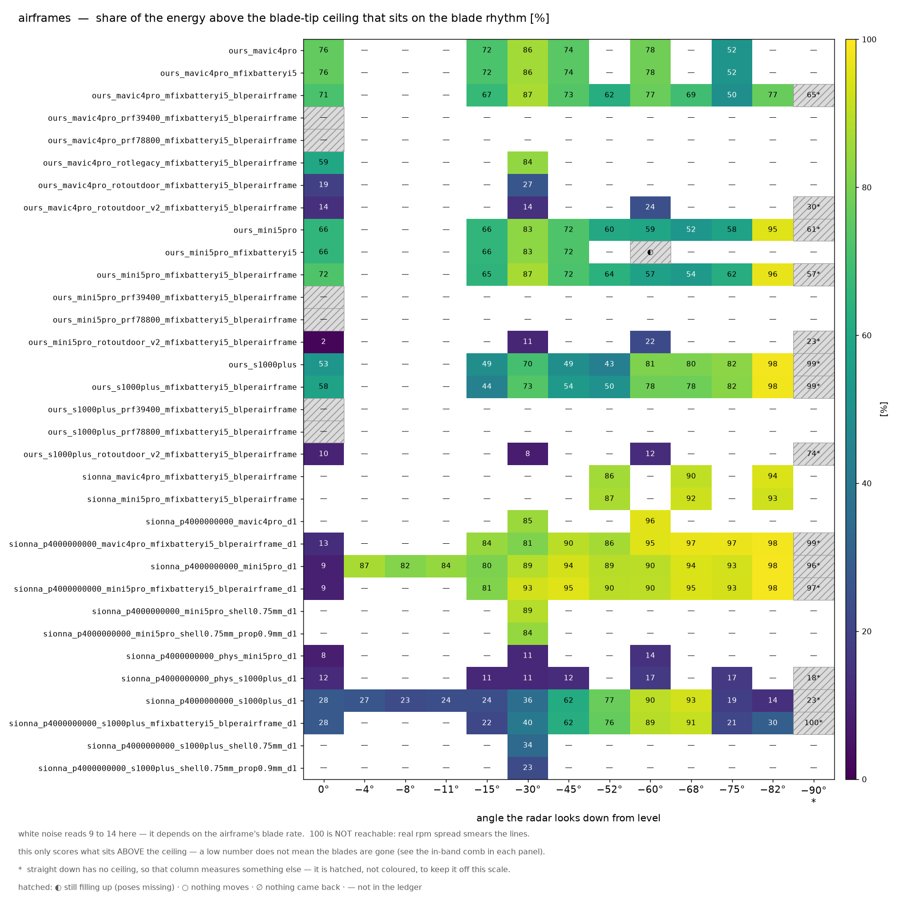

| 팔 | 무엇을 바꾼 판인가 | 앙각 | 리듬 몫[%] | 맵 · 대역 |
|---|---|---|---|---|
| `ours_mini5pro_r15_n8192` | 엔진 **우리 커널**(SBR+PO, 가림 있음) · 거리 15 m · 자세 8,192 개 · 격자 λ/12 · 표적 DJI Mini 5 Pro(**기체 태그**) · 박자 183.333 Hz | 0 −15 −30 −45 −60 −75 −90 | 66 66 83 72 59 58 61 | [맵](../outputs/figures/atlas/03airframe__ours_mini5pro_r15_n8192__map.png) · [대역](../outputs/figures/atlas/03airframe__ours_mini5pro_r15_n8192__band.png) |
| `ours_s1000plus_r15_n8192` | 엔진 **우리 커널**(SBR+PO, 가림 있음) · 거리 15 m · 자세 8,192 개 · 격자 λ/12 · 표적 DJI S1000+(**기체 태그**) · 박자 148.9 Hz | 0 −15 −30 −45 −60 −75 −90 | 53 49 70 49 81 82 99 | [맵](../outputs/figures/atlas/03airframe__ours_s1000plus_r15_n8192__map.png) · [대역](../outputs/figures/atlas/03airframe__ours_s1000plus_r15_n8192__band.png) |
| `sionna_p4000000000_mini5pro_r15_n8192_d1` | 엔진 **Sionna PathSolver** · 거리 15 m · 자세 8,192 개 · 광선 <span title="정확히 4,000,000,000 발">40 억 발</span> · 반사 깊이 1 · 스위치 물리 끔 · 표적 DJI Mini 5 Pro(**기체 태그**) · 박자 183.333 Hz | 0 −15 −30 −45 −60 −75 −90 | 9 80 89 94 90 93 96 | [맵](../outputs/figures/atlas/03airframe__sionna_p4000000000_mini5pro_r15_n8192_d1__map.png) · [대역](../outputs/figures/atlas/03airframe__sionna_p4000000000_mini5pro_r15_n8192_d1__band.png) |
| `sionna_p4000000000_mini5pro_r15_n8192_shell0.75mm_prop0.9mm_d1` | 엔진 **Sionna PathSolver** · 거리 15 m · 자세 8,192 개 · 광선 <span title="정확히 4,000,000,000 발">40 억 발</span> · 반사 깊이 1 · 스위치 물리 끔 · 표적 DJI Mini 5 Pro(**기체 태그**) · 박자 183.333 Hz | −30 | 84 | [맵](../outputs/figures/atlas/03airframe__sionna_p4000000000_mini5pro_r15_n8192_shell0.75mm_prop0.9mm_d1__map.png) · [대역](../outputs/figures/atlas/03airframe__sionna_p4000000000_mini5pro_r15_n8192_shell0.75mm_prop0.9mm_d1__band.png) |
| `sionna_p4000000000_phys_mini5pro_r15_n8192_d1` | 엔진 **Sionna PathSolver** · 거리 15 m · 자세 8,192 개 · 광선 <span title="정확히 4,000,000,000 발">40 억 발</span> · 반사 깊이 1 · 스위치 물리 **전부 켬** · 표적 DJI Mini 5 Pro(**기체 태그**) · 박자 183.333 Hz | 0 −30 −60 | 8 11 14 | [맵](../outputs/figures/atlas/03airframe__sionna_p4000000000_phys_mini5pro_r15_n8192_d1__map.png) · [대역](../outputs/figures/atlas/03airframe__sionna_p4000000000_phys_mini5pro_r15_n8192_d1__band.png) |
| `sionna_p4000000000_phys_s1000plus_r15_n8192_d1` | 엔진 **Sionna PathSolver** · 거리 15 m · 자세 8,192 개 · 광선 <span title="정확히 4,000,000,000 발">40 억 발</span> · 반사 깊이 1 · 스위치 물리 **전부 켬** · 표적 DJI S1000+(**기체 태그**) · 박자 148.9 Hz | 0 −15 −30 −45 −60 −75 −90 | 12 11 11 12 17 17 18 | [맵](../outputs/figures/atlas/03airframe__sionna_p4000000000_phys_s1000plus_r15_n8192_d1__map.png) · [대역](../outputs/figures/atlas/03airframe__sionna_p4000000000_phys_s1000plus_r15_n8192_d1__band.png) |
| `sionna_p4000000000_s1000plus_r15_n8192_d1` | 엔진 **Sionna PathSolver** · 거리 15 m · 자세 8,192 개 · 광선 <span title="정확히 4,000,000,000 발">40 억 발</span> · 반사 깊이 1 · 스위치 물리 끔 · 표적 DJI S1000+(**기체 태그**) · 박자 148.9 Hz | 0 −15 −30 −45 −60 −75 −90 | 28 24 36 62 90 19 23 | [맵](../outputs/figures/atlas/03airframe__sionna_p4000000000_s1000plus_r15_n8192_d1__map.png) · [대역](../outputs/figures/atlas/03airframe__sionna_p4000000000_s1000plus_r15_n8192_d1__band.png) |
| `sionna_p4000000000_s1000plus_r15_n8192_shell0.75mm_prop0.9mm_d1` | 엔진 **Sionna PathSolver** · 거리 15 m · 자세 8,192 개 · 광선 <span title="정확히 4,000,000,000 발">40 억 발</span> · 반사 깊이 1 · 스위치 물리 끔 · 표적 DJI S1000+(**기체 태그**) · 박자 148.9 Hz | −30 | 23 | [맵](../outputs/figures/atlas/03airframe__sionna_p4000000000_s1000plus_r15_n8192_shell0.75mm_prop0.9mm_d1__map.png) · [대역](../outputs/figures/atlas/03airframe__sionna_p4000000000_s1000plus_r15_n8192_shell0.75mm_prop0.9mm_d1__band.png) |

### 04. 드론이 돌면 어떻게 되나

> 정면(방위 0°)이 아니라 옆에서 본 판이다. 지금까지의 결론이 방위 한 자리에서만 서는 것인지 확인한다.

팔 14 개 · 칸 29 개 · 그림 31 장 · 페이지 [`04_azimuth.html`](04_azimuth.html)

**⭐ 핵심 발견**

- ⌗**플래시가 한 표본 폭으로 찍힌 칸이 2 개** 있다 — 튐이 **아니라** 시간 분해능 문제다(참 신호가 표본 간격보다 좁다). 그 칸의 «상한 위 몫 · 빗살 대비»를 인용할 때는 그 단서를 함께 적는다.
- 앙각 −30° 에서 팔 14 개를 늘어놓으면 리듬 몫이 **14.5 %**(`sionna_p4000000000_phys_r15_n8192_az45_d1`) 에서 **89.7 %**(`ours_r15_n8192_az15`) 까지 벌어진다 — 폭 75.2 %p 는 격자 흔들림 밴드 21.8 %p 밖이라 **차이가 살아 있다**. ⚠양 끝 두 팔은 광선 예산 · 반사 깊이도 다르다 — 이 폭을 «엔진 차이»로 읽으면 안 된다.
- 박자(날개가 시선을 지나가는 빠르기)를 잰 팔 14 개 중 **10 개**가 자기 기체의 예측 박자 ±2 % 안에 든다 — 나머지 4 개는 봉우리가 다른 자리에 섰다는 뜻이니 대역 그림에서 점선과 봉우리가 어긋났는지 본다.
- 한 축만 다른 짝(`sionna_p4000000000_r15_n8192_az45_d1` ↔ `sionna_p4000000000_r15_n8192_d1`)을 같은 앙각 3 칸에서 빼면 리듬 몫 차이가 가장 큰 곳이 **68.9 %p**(평균 +25.0 %p) — 격자 흔들림 밴드 21.8 %p 밖이라 **차이가 살아 있다**. 뺀 칸 1 개(잣대 퇴화 · 수를 낼 자격 없음)는 셈에서 제외했다. ⭐짝이 있는 팔은 14 개인데 그중 밴드 밖은 **1 개**다 — 여기 적은 것은 그중 **가장 큰 한 짝**일 뿐이니 주제 전체의 결론으로 읽지 마라(팔마다 링크를 달아 두었다).

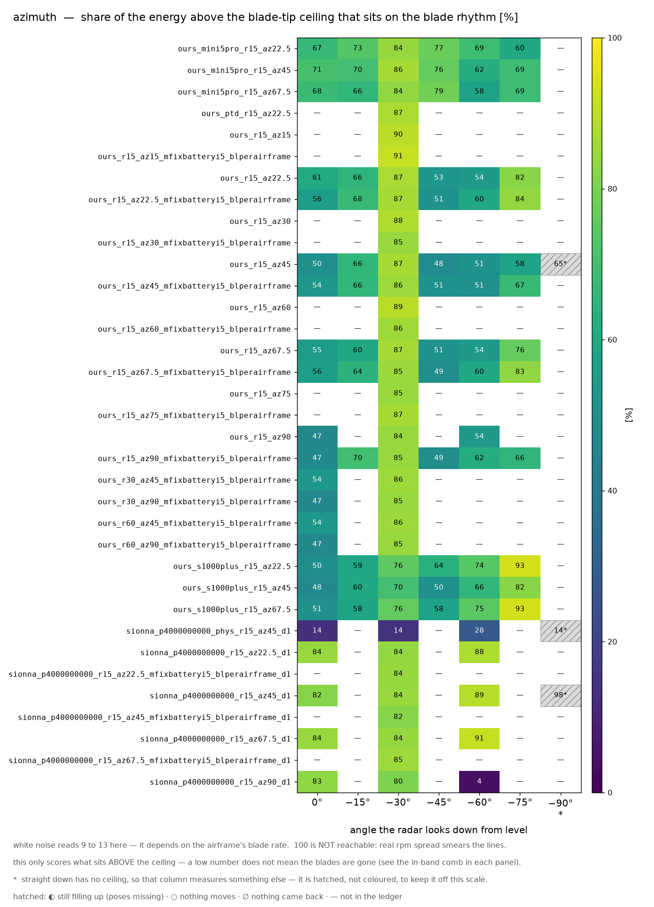

| 팔 | 무엇을 바꾼 판인가 | 앙각 | 리듬 몫[%] | 맵 · 대역 |
|---|---|---|---|---|
| `ours_mini5pro_r15_n8192_az22.5` | 엔진 **우리 커널**(SBR+PO, 가림 있음) · 거리 15 m · 자세 8,192 개 · 격자 λ/12 · 방위 22.5° · 표적 DJI Mini 5 Pro(**기체 태그**) · 박자 183.333 Hz | 0 −30 | 67 84 | [맵](../outputs/figures/atlas/04azimuth__ours_mini5pro_r15_n8192_az22.5__map.png) · [대역](../outputs/figures/atlas/04azimuth__ours_mini5pro_r15_n8192_az22.5__band.png) |
| `ours_ptd_r15_n8192_az22.5` | 엔진 **우리 커널**(SBR+PO, 가림 있음) · 거리 15 m · 자세 8,192 개 · 격자 λ/12 · 모서리 보정(PTD) **켬** · 방위 22.5° · 표적 DJI Matrice 4E · 박자 126.667 Hz | −30 | 87 | [맵](../outputs/figures/atlas/04azimuth__ours_ptd_r15_n8192_az22.5__map.png) · [대역](../outputs/figures/atlas/04azimuth__ours_ptd_r15_n8192_az22.5__band.png) |
| `ours_r15_n8192_az15` | 엔진 **우리 커널**(SBR+PO, 가림 있음) · 거리 15 m · 자세 8,192 개 · 격자 λ/12 · 방위 15° · 표적 DJI Matrice 4E · 박자 126.667 Hz | −30 | 90 | [맵](../outputs/figures/atlas/04azimuth__ours_r15_n8192_az15__map.png) · [대역](../outputs/figures/atlas/04azimuth__ours_r15_n8192_az15__band.png) |
| `ours_r15_n8192_az22.5` | 엔진 **우리 커널**(SBR+PO, 가림 있음) · 거리 15 m · 자세 8,192 개 · 격자 λ/12 · 방위 22.5° · 표적 DJI Matrice 4E · 박자 126.667 Hz | 0 −30 −60 | 61 87 54 | [맵](../outputs/figures/atlas/04azimuth__ours_r15_n8192_az22.5__map.png) · [대역](../outputs/figures/atlas/04azimuth__ours_r15_n8192_az22.5__band.png) |
| `ours_r15_n8192_az30` | 엔진 **우리 커널**(SBR+PO, 가림 있음) · 거리 15 m · 자세 8,192 개 · 격자 λ/12 · 방위 30° · 표적 DJI Matrice 4E · 박자 126.667 Hz | −30 | 88 | [맵](../outputs/figures/atlas/04azimuth__ours_r15_n8192_az30__map.png) · [대역](../outputs/figures/atlas/04azimuth__ours_r15_n8192_az30__band.png) |
| `ours_r15_n8192_az45` | 엔진 **우리 커널**(SBR+PO, 가림 있음) · 거리 15 m · 자세 8,192 개 · 격자 λ/12 · 방위 45° · 표적 DJI Matrice 4E · 박자 126.667 Hz | 0 −30 −60 −90 | 50 87 51 65 | [맵](../outputs/figures/atlas/04azimuth__ours_r15_n8192_az45__map.png) · [대역](../outputs/figures/atlas/04azimuth__ours_r15_n8192_az45__band.png) |
| `ours_r15_n8192_az60` | 엔진 **우리 커널**(SBR+PO, 가림 있음) · 거리 15 m · 자세 8,192 개 · 격자 λ/12 · 방위 60° · 표적 DJI Matrice 4E · 박자 126.667 Hz | −30 | 89 | [맵](../outputs/figures/atlas/04azimuth__ours_r15_n8192_az60__map.png) · [대역](../outputs/figures/atlas/04azimuth__ours_r15_n8192_az60__band.png) |
| `ours_r15_n8192_az67.5` | 엔진 **우리 커널**(SBR+PO, 가림 있음) · 거리 15 m · 자세 8,192 개 · 격자 λ/12 · 방위 67.5° · 표적 DJI Matrice 4E · 박자 126.667 Hz | 0 −30 −60 | 55 87 54 | [맵](../outputs/figures/atlas/04azimuth__ours_r15_n8192_az67.5__map.png) · [대역](../outputs/figures/atlas/04azimuth__ours_r15_n8192_az67.5__band.png) |
| `ours_r15_n8192_az75` | 엔진 **우리 커널**(SBR+PO, 가림 있음) · 거리 15 m · 자세 8,192 개 · 격자 λ/12 · 방위 75° · 표적 DJI Matrice 4E · 박자 126.667 Hz | −30 | 85 | [맵](../outputs/figures/atlas/04azimuth__ours_r15_n8192_az75__map.png) · [대역](../outputs/figures/atlas/04azimuth__ours_r15_n8192_az75__band.png) |
| `ours_r15_n8192_az90` | 엔진 **우리 커널**(SBR+PO, 가림 있음) · 거리 15 m · 자세 8,192 개 · 격자 λ/12 · 방위 90° · 표적 DJI Matrice 4E · 박자 126.667 Hz | −30 | 84 | [맵](../outputs/figures/atlas/04azimuth__ours_r15_n8192_az90__map.png) · [대역](../outputs/figures/atlas/04azimuth__ours_r15_n8192_az90__band.png) |
| `ours_s1000plus_r15_n8192_az22.5` | 엔진 **우리 커널**(SBR+PO, 가림 있음) · 거리 15 m · 자세 8,192 개 · 격자 λ/12 · 방위 22.5° · 표적 DJI S1000+(**기체 태그**) · 박자 148.9 Hz | 0 −30 | 50 76 | [맵](../outputs/figures/atlas/04azimuth__ours_s1000plus_r15_n8192_az22.5__map.png) · [대역](../outputs/figures/atlas/04azimuth__ours_s1000plus_r15_n8192_az22.5__band.png) |
| `sionna_p4000000000_phys_r15_n8192_az45_d1` | 엔진 **Sionna PathSolver** · 거리 15 m · 자세 8,192 개 · 광선 <span title="정확히 4,000,000,000 발">40 억 발</span> · 반사 깊이 1 · 스위치 물리 **전부 켬** · 방위 45° · 표적 DJI Matrice 4E · 박자 126.667 Hz | 0 −30 −60 −90 | 14 14 28 14 | [맵](../outputs/figures/atlas/04azimuth__sionna_p4000000000_phys_r15_n8192_az45_d1__map.png) · [대역](../outputs/figures/atlas/04azimuth__sionna_p4000000000_phys_r15_n8192_az45_d1__band.png) |
| `sionna_p4000000000_r15_n8192_az22.5_d1` | 엔진 **Sionna PathSolver** · 거리 15 m · 자세 8,192 개 · 광선 <span title="정확히 4,000,000,000 발">40 억 발</span> · 반사 깊이 1 · 스위치 물리 끔 · 방위 22.5° · 표적 DJI Matrice 4E · 박자 126.667 Hz | −30 | 84 | [맵](../outputs/figures/atlas/04azimuth__sionna_p4000000000_r15_n8192_az22.5_d1__map.png) · [대역](../outputs/figures/atlas/04azimuth__sionna_p4000000000_r15_n8192_az22.5_d1__band.png) |
| `sionna_p4000000000_r15_n8192_az45_d1` | 엔진 **Sionna PathSolver** · 거리 15 m · 자세 8,192 개 · 광선 <span title="정확히 4,000,000,000 발">40 억 발</span> · 반사 깊이 1 · 스위치 물리 끔 · 방위 45° · 표적 DJI Matrice 4E · 박자 126.667 Hz | 0 −30 −60 −90 | 82 84 89 98 | [맵](../outputs/figures/atlas/04azimuth__sionna_p4000000000_r15_n8192_az45_d1__map.png) · [대역](../outputs/figures/atlas/04azimuth__sionna_p4000000000_r15_n8192_az45_d1__band.png) |

### 05. 날개 신호는 어디서 오나

> 장면에서 부품을 빼 본 판이다. 프로펠러만 남기거나, 프로펠러만 뺀다. 날개 무늬를 만드는 것이 정말 프로펠러인지 귀속시킨다.

팔 3 개 · 칸 9 개 · 그림 8 장 · 페이지 [`05_parts.html`](05_parts.html)

**⭐ 핵심 발견**

- 앙각 0° 에서 팔 2 개를 늘어놓으면 리듬 몫이 **12.7 %**(`sionna_p4000000000_phys_partsprop_r15_n8192_d1`) 에서 **89.7 %**(`sionna_p4000000000_partsprop_r15_n8192_d1`) 까지 벌어진다 — 폭 77.0 %p 는 격자 흔들림 밴드 21.8 %p 밖이라 **차이가 살아 있다**.
- 박자(날개가 시선을 지나가는 빠르기)를 잰 팔 2 개 중 **2 개**가 자기 기체의 예측 박자 ±2 % 안에 든다.
- 한 축만 다른 짝(`sionna_p4000000000_partsprop_r15_n8192_d1` ↔ `sionna_p4000000000_r15_n8192_d1`)을 같은 앙각 3 칸에서 빼면 리듬 몫 차이가 가장 큰 곳이 **76.6 %p**(평균 +25.7 %p) — 격자 흔들림 밴드 21.8 %p 밖이라 **차이가 살아 있다**. 뺀 칸 1 개(잣대 퇴화 · 수를 낼 자격 없음)는 셈에서 제외했다. ⭐짝이 있는 팔은 2 개인데 그중 밴드 밖은 **1 개**다 — 여기 적은 것은 그중 **가장 큰 한 짝**일 뿐이니 주제 전체의 결론으로 읽지 마라(팔마다 링크를 달아 두었다).

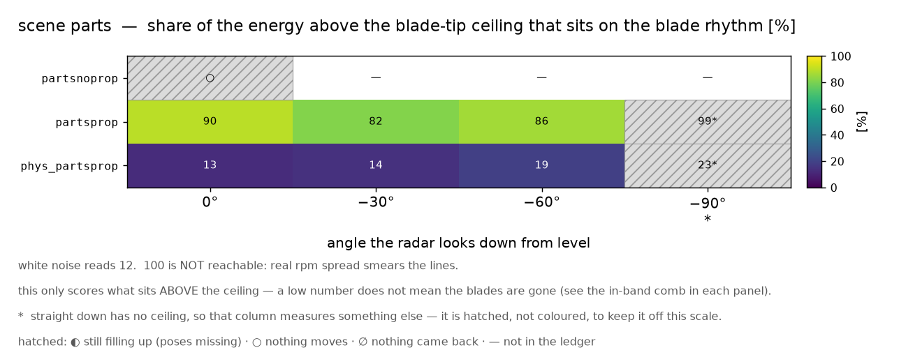

| 팔 | 무엇을 바꾼 판인가 | 앙각 | 리듬 몫[%] | 맵 · 대역 |
|---|---|---|---|---|
| `sionna_p4000000000_partsnoprop_r15_n8192_d1` | 엔진 **Sionna PathSolver** · 거리 15 m · 자세 8,192 개 · 광선 <span title="정확히 4,000,000,000 발">40 억 발</span> · 반사 깊이 1 · 스위치 물리 끔 · 장면 **프로펠러 뺀 나머지** · 표적 DJI Matrice 4E · 박자 126.667 Hz | 0 | — | [맵](../outputs/figures/atlas/05parts__sionna_p4000000000_partsnoprop_r15_n8192_d1__map.png) · [대역](../outputs/figures/atlas/05parts__sionna_p4000000000_partsnoprop_r15_n8192_d1__band.png) |
| `sionna_p4000000000_partsprop_r15_n8192_d1` | 엔진 **Sionna PathSolver** · 거리 15 m · 자세 8,192 개 · 광선 <span title="정확히 4,000,000,000 발">40 억 발</span> · 반사 깊이 1 · 스위치 물리 끔 · 장면 **프로펠러만** · 표적 DJI Matrice 4E · 박자 126.667 Hz | 0 −30 −60 −90 | 90 82 86 99 | [맵](../outputs/figures/atlas/05parts__sionna_p4000000000_partsprop_r15_n8192_d1__map.png) · [대역](../outputs/figures/atlas/05parts__sionna_p4000000000_partsprop_r15_n8192_d1__band.png) |
| `sionna_p4000000000_phys_partsprop_r15_n8192_d1` | 엔진 **Sionna PathSolver** · 거리 15 m · 자세 8,192 개 · 광선 <span title="정확히 4,000,000,000 발">40 억 발</span> · 반사 깊이 1 · 스위치 물리 **전부 켬** · 장면 **프로펠러만** · 표적 DJI Matrice 4E · 박자 126.667 Hz | 0 −30 −60 −90 | 13 14 19 23 | [맵](../outputs/figures/atlas/05parts__sionna_p4000000000_phys_partsprop_r15_n8192_d1__map.png) · [대역](../outputs/figures/atlas/05parts__sionna_p4000000000_phys_partsprop_r15_n8192_d1__band.png) |

### 06. 멀어지면 어떻게 되나

> 표적까지의 거리를 15 m 에서 30 m 로 물린 판이다. 멀어지면 되돌아오는 힘이 약해지는데, 무늬 자체가 남는지를 본다. ⚠<b>이 주제의 잣대는 거리를 못 읽는다</b> — 리듬 몫도 빗살 대비도 «모양»을 재는 수라 에코 전체가 공통 인수로 작아지는 것에 둔감하다. 거리를 말하려면 절대 눈금(dB)이 함께 있어야 하는데, 엔진끼리는 그 dB 를 비교할 수 없다. 그러니 여기서 읽을 수 있는 것은 «같은 엔진 안에서 무늬가 남았나»뿐이다.

팔 30 개 · 칸 64 개 · 그림 66 장 · 페이지 [`06_range.html`](06_range.html)

**⭐ 핵심 발견**

- ⛔**이 주제는 아직 결론을 낼 수 없다** — 칸 1 개가 **자세가 덜 찬 상태**다(병합이 절반이다). 빈 자세 자리가 0 으로 채워져 있어서 그 0 채움이 스펙트럼을 PRF/2 · PRF/4 에 복제하고, 그 복제본이 «상한 위»를 삼켜 리듬 몫을 0 % 로 만든다 — 물리가 아니라 **결측 자국**이다. 그래서 그 칸에는 수를 싣지 않았다(`sionna_p4000000000_r480_n8192_d1` −30°). 원장을 다시 병합한 뒤에 읽어야 한다. 남은 읽을 수 있는 칸은 62 개다.
- ⌗**플래시가 한 표본 폭으로 찍힌 칸이 3 개** 있다 — 튐이 **아니라** 시간 분해능 문제다(참 신호가 표본 간격보다 좁다). 그 칸의 «상한 위 몫 · 빗살 대비»를 인용할 때는 그 단서를 함께 적는다.
- 앙각 −30° 에서 팔 29 개를 늘어놓으면 리듬 몫이 **13.5 %**(`sionna_p4000000000_phys_r120_n8192_d1`) 에서 **88.6 %**(`sionna_p4000000000_mini5pro_r30_n8192_d1`) 까지 벌어진다 — 폭 75.1 %p 는 격자 흔들림 밴드 21.8 %p 밖이라 **차이가 살아 있다**. ⚠양 끝 두 팔은 거리도 다르다 — 이 폭을 «엔진 차이»로 읽으면 안 된다.
- 박자(날개가 시선을 지나가는 빠르기)를 잰 팔 29 개 중 **27 개**가 자기 기체의 예측 박자 ±2 % 안에 든다 — 나머지 2 개는 봉우리가 다른 자리에 섰다는 뜻이니 대역 그림에서 점선과 봉우리가 어긋났는지 본다.
- 한 축만 다른 짝(`sionna_p4000000000_mini5pro_r60_n8192_d1` ↔ `sionna_p4000000000_mini5pro_r15_n8192_d1`)을 같은 앙각 2 칸에서 빼면 리듬 몫 차이가 가장 큰 곳이 **79.1 %p**(평균 +38.8 %p) — 격자 흔들림 밴드 21.8 %p 밖이라 **차이가 살아 있다**. ⭐짝이 있는 팔은 27 개인데 그중 밴드 밖은 **5 개**다 — 여기 적은 것은 그중 **가장 큰 한 짝**일 뿐이니 주제 전체의 결론으로 읽지 마라(팔마다 링크를 달아 두었다).

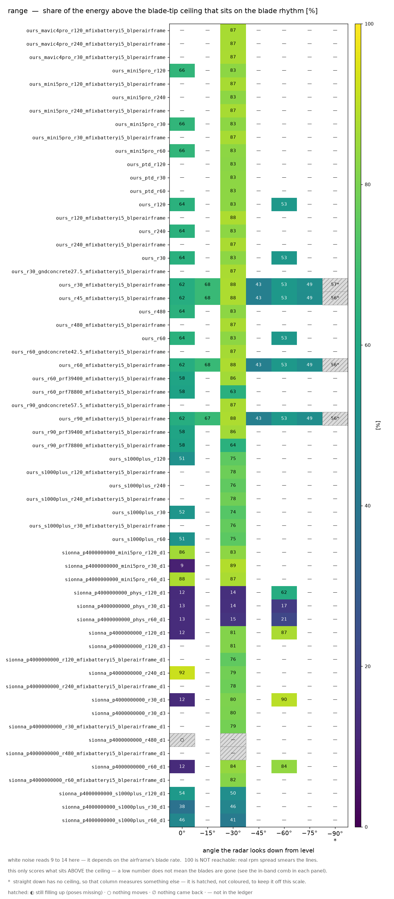

| 팔 | 무엇을 바꾼 판인가 | 앙각 | 리듬 몫[%] | 맵 · 대역 |
|---|---|---|---|---|
| `ours_mini5pro_r120_n8192` | 엔진 **우리 커널**(SBR+PO, 가림 있음) · 거리 120 m · 자세 8,192 개 · 격자 λ/12 · 표적 DJI Mini 5 Pro(**기체 태그**) · 박자 183.333 Hz | 0 −30 | 66 83 | [맵](../outputs/figures/atlas/06range__ours_mini5pro_r120_n8192__map.png) · [대역](../outputs/figures/atlas/06range__ours_mini5pro_r120_n8192__band.png) |
| `ours_mini5pro_r30_n8192` | 엔진 **우리 커널**(SBR+PO, 가림 있음) · 거리 30 m · 자세 8,192 개 · 격자 λ/12 · 표적 DJI Mini 5 Pro(**기체 태그**) · 박자 183.333 Hz | 0 −30 | 66 83 | [맵](../outputs/figures/atlas/06range__ours_mini5pro_r30_n8192__map.png) · [대역](../outputs/figures/atlas/06range__ours_mini5pro_r30_n8192__band.png) |
| `ours_mini5pro_r60_n8192` | 엔진 **우리 커널**(SBR+PO, 가림 있음) · 거리 60 m · 자세 8,192 개 · 격자 λ/12 · 표적 DJI Mini 5 Pro(**기체 태그**) · 박자 183.333 Hz | 0 −30 | 66 83 | [맵](../outputs/figures/atlas/06range__ours_mini5pro_r60_n8192__map.png) · [대역](../outputs/figures/atlas/06range__ours_mini5pro_r60_n8192__band.png) |
| `ours_ptd_r120_n8192` | 엔진 **우리 커널**(SBR+PO, 가림 있음) · 거리 120 m · 자세 8,192 개 · 격자 λ/12 · 모서리 보정(PTD) **켬** · 표적 DJI Matrice 4E · 박자 126.667 Hz | −30 | 83 | [맵](../outputs/figures/atlas/06range__ours_ptd_r120_n8192__map.png) · [대역](../outputs/figures/atlas/06range__ours_ptd_r120_n8192__band.png) |
| `ours_ptd_r30_n8192` | 엔진 **우리 커널**(SBR+PO, 가림 있음) · 거리 30 m · 자세 8,192 개 · 격자 λ/12 · 모서리 보정(PTD) **켬** · 표적 DJI Matrice 4E · 박자 126.667 Hz | −30 | 83 | [맵](../outputs/figures/atlas/06range__ours_ptd_r30_n8192__map.png) · [대역](../outputs/figures/atlas/06range__ours_ptd_r30_n8192__band.png) |
| `ours_ptd_r60_n8192` | 엔진 **우리 커널**(SBR+PO, 가림 있음) · 거리 60 m · 자세 8,192 개 · 격자 λ/12 · 모서리 보정(PTD) **켬** · 표적 DJI Matrice 4E · 박자 126.667 Hz | −30 | 83 | [맵](../outputs/figures/atlas/06range__ours_ptd_r60_n8192__map.png) · [대역](../outputs/figures/atlas/06range__ours_ptd_r60_n8192__band.png) |
| `ours_r120_n8192` | 엔진 **우리 커널**(SBR+PO, 가림 있음) · 거리 120 m · 자세 8,192 개 · 격자 λ/12 · 표적 DJI Matrice 4E · 박자 126.667 Hz | 0 −30 −60 | 64 83 53 | [맵](../outputs/figures/atlas/06range__ours_r120_n8192__map.png) · [대역](../outputs/figures/atlas/06range__ours_r120_n8192__band.png) |
| `ours_r240_n8192` | 엔진 **우리 커널**(SBR+PO, 가림 있음) · 거리 240 m · 자세 8,192 개 · 격자 λ/12 · 표적 DJI Matrice 4E · 박자 126.667 Hz | 0 −30 | 64 83 | [맵](../outputs/figures/atlas/06range__ours_r240_n8192__map.png) · [대역](../outputs/figures/atlas/06range__ours_r240_n8192__band.png) |
| `ours_r30_n8192` | 엔진 **우리 커널**(SBR+PO, 가림 있음) · 거리 30 m · 자세 8,192 개 · 격자 λ/12 · 표적 DJI Matrice 4E · 박자 126.667 Hz | 0 −30 −60 | 64 83 53 | [맵](../outputs/figures/atlas/06range__ours_r30_n8192__map.png) · [대역](../outputs/figures/atlas/06range__ours_r30_n8192__band.png) |
| `ours_r480_n8192` | 엔진 **우리 커널**(SBR+PO, 가림 있음) · 거리 480 m · 자세 8,192 개 · 격자 λ/12 · 표적 DJI Matrice 4E · 박자 126.667 Hz | 0 −30 | 64 83 | [맵](../outputs/figures/atlas/06range__ours_r480_n8192__map.png) · [대역](../outputs/figures/atlas/06range__ours_r480_n8192__band.png) |
| `ours_r60_n8192` | 엔진 **우리 커널**(SBR+PO, 가림 있음) · 거리 60 m · 자세 8,192 개 · 격자 λ/12 · 표적 DJI Matrice 4E · 박자 126.667 Hz | 0 −30 −60 | 64 83 53 | [맵](../outputs/figures/atlas/06range__ours_r60_n8192__map.png) · [대역](../outputs/figures/atlas/06range__ours_r60_n8192__band.png) |
| `ours_s1000plus_r120_n8192` | 엔진 **우리 커널**(SBR+PO, 가림 있음) · 거리 120 m · 자세 8,192 개 · 격자 λ/12 · 표적 DJI S1000+(**기체 태그**) · 박자 148.9 Hz | 0 −30 | 51 75 | [맵](../outputs/figures/atlas/06range__ours_s1000plus_r120_n8192__map.png) · [대역](../outputs/figures/atlas/06range__ours_s1000plus_r120_n8192__band.png) |
| `ours_s1000plus_r30_n8192` | 엔진 **우리 커널**(SBR+PO, 가림 있음) · 거리 30 m · 자세 8,192 개 · 격자 λ/12 · 표적 DJI S1000+(**기체 태그**) · 박자 148.9 Hz | 0 −30 | 52 74 | [맵](../outputs/figures/atlas/06range__ours_s1000plus_r30_n8192__map.png) · [대역](../outputs/figures/atlas/06range__ours_s1000plus_r30_n8192__band.png) |
| `ours_s1000plus_r60_n8192` | 엔진 **우리 커널**(SBR+PO, 가림 있음) · 거리 60 m · 자세 8,192 개 · 격자 λ/12 · 표적 DJI S1000+(**기체 태그**) · 박자 148.9 Hz | 0 −30 | 51 75 | [맵](../outputs/figures/atlas/06range__ours_s1000plus_r60_n8192__map.png) · [대역](../outputs/figures/atlas/06range__ours_s1000plus_r60_n8192__band.png) |
| `sionna_p4000000000_mini5pro_r120_n8192_d1` | 엔진 **Sionna PathSolver** · 거리 120 m · 자세 8,192 개 · 광선 <span title="정확히 4,000,000,000 발">40 억 발</span> · 반사 깊이 1 · 스위치 물리 끔 · 표적 DJI Mini 5 Pro(**기체 태그**) · 박자 183.333 Hz | 0 −30 | 86 83 | [맵](../outputs/figures/atlas/06range__sionna_p4000000000_mini5pro_r120_n8192_d1__map.png) · [대역](../outputs/figures/atlas/06range__sionna_p4000000000_mini5pro_r120_n8192_d1__band.png) |
| `sionna_p4000000000_mini5pro_r30_n8192_d1` | 엔진 **Sionna PathSolver** · 거리 30 m · 자세 8,192 개 · 광선 <span title="정확히 4,000,000,000 발">40 억 발</span> · 반사 깊이 1 · 스위치 물리 끔 · 표적 DJI Mini 5 Pro(**기체 태그**) · 박자 183.333 Hz | 0 −30 | 9 89 | [맵](../outputs/figures/atlas/06range__sionna_p4000000000_mini5pro_r30_n8192_d1__map.png) · [대역](../outputs/figures/atlas/06range__sionna_p4000000000_mini5pro_r30_n8192_d1__band.png) |
| `sionna_p4000000000_mini5pro_r60_n8192_d1` | 엔진 **Sionna PathSolver** · 거리 60 m · 자세 8,192 개 · 광선 <span title="정확히 4,000,000,000 발">40 억 발</span> · 반사 깊이 1 · 스위치 물리 끔 · 표적 DJI Mini 5 Pro(**기체 태그**) · 박자 183.333 Hz | 0 −30 | 88 87 | [맵](../outputs/figures/atlas/06range__sionna_p4000000000_mini5pro_r60_n8192_d1__map.png) · [대역](../outputs/figures/atlas/06range__sionna_p4000000000_mini5pro_r60_n8192_d1__band.png) |
| `sionna_p4000000000_phys_r120_n8192_d1` | 엔진 **Sionna PathSolver** · 거리 120 m · 자세 8,192 개 · 광선 <span title="정확히 4,000,000,000 발">40 억 발</span> · 반사 깊이 1 · 스위치 물리 **전부 켬** · 표적 DJI Matrice 4E · 박자 126.667 Hz | 0 −30 −60 | 12 14 62 | [맵](../outputs/figures/atlas/06range__sionna_p4000000000_phys_r120_n8192_d1__map.png) · [대역](../outputs/figures/atlas/06range__sionna_p4000000000_phys_r120_n8192_d1__band.png) |
| `sionna_p4000000000_phys_r30_n8192_d1` | 엔진 **Sionna PathSolver** · 거리 30 m · 자세 8,192 개 · 광선 <span title="정확히 4,000,000,000 발">40 억 발</span> · 반사 깊이 1 · 스위치 물리 **전부 켬** · 표적 DJI Matrice 4E · 박자 126.667 Hz | 0 −30 −60 | 13 14 17 | [맵](../outputs/figures/atlas/06range__sionna_p4000000000_phys_r30_n8192_d1__map.png) · [대역](../outputs/figures/atlas/06range__sionna_p4000000000_phys_r30_n8192_d1__band.png) |
| `sionna_p4000000000_phys_r60_n8192_d1` | 엔진 **Sionna PathSolver** · 거리 60 m · 자세 8,192 개 · 광선 <span title="정확히 4,000,000,000 발">40 억 발</span> · 반사 깊이 1 · 스위치 물리 **전부 켬** · 표적 DJI Matrice 4E · 박자 126.667 Hz | 0 −30 −60 | 13 15 21 | [맵](../outputs/figures/atlas/06range__sionna_p4000000000_phys_r60_n8192_d1__map.png) · [대역](../outputs/figures/atlas/06range__sionna_p4000000000_phys_r60_n8192_d1__band.png) |
| `sionna_p4000000000_r120_n8192_d1` | 엔진 **Sionna PathSolver** · 거리 120 m · 자세 8,192 개 · 광선 <span title="정확히 4,000,000,000 발">40 억 발</span> · 반사 깊이 1 · 스위치 물리 끔 · 표적 DJI Matrice 4E · 박자 126.667 Hz | 0 −30 −60 | 12 81 87 | [맵](../outputs/figures/atlas/06range__sionna_p4000000000_r120_n8192_d1__map.png) · [대역](../outputs/figures/atlas/06range__sionna_p4000000000_r120_n8192_d1__band.png) |
| `sionna_p4000000000_r120_n8192_d3` | 엔진 **Sionna PathSolver** · 거리 120 m · 자세 8,192 개 · 광선 <span title="정확히 4,000,000,000 발">40 억 발</span> · 반사 깊이 3 · 스위치 물리 끔 · 표적 DJI Matrice 4E · 박자 126.667 Hz | −30 | 81 | [맵](../outputs/figures/atlas/06range__sionna_p4000000000_r120_n8192_d3__map.png) · [대역](../outputs/figures/atlas/06range__sionna_p4000000000_r120_n8192_d3__band.png) |
| `sionna_p4000000000_r240_n8192_d1` | 엔진 **Sionna PathSolver** · 거리 240 m · 자세 8,192 개 · 광선 <span title="정확히 4,000,000,000 발">40 억 발</span> · 반사 깊이 1 · 스위치 물리 끔 · 표적 DJI Matrice 4E · 박자 126.667 Hz | 0 −30 | 92 79 | [맵](../outputs/figures/atlas/06range__sionna_p4000000000_r240_n8192_d1__map.png) · [대역](../outputs/figures/atlas/06range__sionna_p4000000000_r240_n8192_d1__band.png) |
| `sionna_p4000000000_r30_n8192_d1` | 엔진 **Sionna PathSolver** · 거리 30 m · 자세 8,192 개 · 광선 <span title="정확히 4,000,000,000 발">40 억 발</span> · 반사 깊이 1 · 스위치 물리 끔 · 표적 DJI Matrice 4E · 박자 126.667 Hz | 0 −30 −60 | 12 80 90 | [맵](../outputs/figures/atlas/06range__sionna_p4000000000_r30_n8192_d1__map.png) · [대역](../outputs/figures/atlas/06range__sionna_p4000000000_r30_n8192_d1__band.png) |
| `sionna_p4000000000_r30_n8192_d3` | 엔진 **Sionna PathSolver** · 거리 30 m · 자세 8,192 개 · 광선 <span title="정확히 4,000,000,000 발">40 억 발</span> · 반사 깊이 3 · 스위치 물리 끔 · 표적 DJI Matrice 4E · 박자 126.667 Hz | −30 | 80 | [맵](../outputs/figures/atlas/06range__sionna_p4000000000_r30_n8192_d3__map.png) · [대역](../outputs/figures/atlas/06range__sionna_p4000000000_r30_n8192_d3__band.png) |
| `sionna_p4000000000_r480_n8192_d1` | 엔진 **Sionna PathSolver** · 거리 480 m · 자세 8,192 개 · 광선 <span title="정확히 4,000,000,000 발">40 억 발</span> · 반사 깊이 1 · 스위치 물리 끔 · 표적 DJI Matrice 4E · 박자 126.667 Hz | 0 −30 | — — | [맵](../outputs/figures/atlas/06range__sionna_p4000000000_r480_n8192_d1__map.png) · [대역](../outputs/figures/atlas/06range__sionna_p4000000000_r480_n8192_d1__band.png) |
| `sionna_p4000000000_r60_n8192_d1` | 엔진 **Sionna PathSolver** · 거리 60 m · 자세 8,192 개 · 광선 <span title="정확히 4,000,000,000 발">40 억 발</span> · 반사 깊이 1 · 스위치 물리 끔 · 표적 DJI Matrice 4E · 박자 126.667 Hz | 0 −30 −60 | 12 84 84 | [맵](../outputs/figures/atlas/06range__sionna_p4000000000_r60_n8192_d1__map.png) · [대역](../outputs/figures/atlas/06range__sionna_p4000000000_r60_n8192_d1__band.png) |
| `sionna_p4000000000_s1000plus_r120_n8192_d1` | 엔진 **Sionna PathSolver** · 거리 120 m · 자세 8,192 개 · 광선 <span title="정확히 4,000,000,000 발">40 억 발</span> · 반사 깊이 1 · 스위치 물리 끔 · 표적 DJI S1000+(**기체 태그**) · 박자 148.9 Hz | 0 −30 | 54 50 | [맵](../outputs/figures/atlas/06range__sionna_p4000000000_s1000plus_r120_n8192_d1__map.png) · [대역](../outputs/figures/atlas/06range__sionna_p4000000000_s1000plus_r120_n8192_d1__band.png) |
| `sionna_p4000000000_s1000plus_r30_n8192_d1` | 엔진 **Sionna PathSolver** · 거리 30 m · 자세 8,192 개 · 광선 <span title="정확히 4,000,000,000 발">40 억 발</span> · 반사 깊이 1 · 스위치 물리 끔 · 표적 DJI S1000+(**기체 태그**) · 박자 148.9 Hz | 0 −30 | 38 46 | [맵](../outputs/figures/atlas/06range__sionna_p4000000000_s1000plus_r30_n8192_d1__map.png) · [대역](../outputs/figures/atlas/06range__sionna_p4000000000_s1000plus_r30_n8192_d1__band.png) |
| `sionna_p4000000000_s1000plus_r60_n8192_d1` | 엔진 **Sionna PathSolver** · 거리 60 m · 자세 8,192 개 · 광선 <span title="정확히 4,000,000,000 발">40 억 발</span> · 반사 깊이 1 · 스위치 물리 끔 · 표적 DJI S1000+(**기체 태그**) · 박자 148.9 Hz | 0 −30 | 46 41 | [맵](../outputs/figures/atlas/06range__sionna_p4000000000_s1000plus_r60_n8192_d1__map.png) · [대역](../outputs/figures/atlas/06range__sionna_p4000000000_s1000plus_r60_n8192_d1__band.png) |

### 07. 모서리 보정이 무늬를 바꾸나

> 우리 커널의 모서리 회절 보정(PTD — 날카로운 모서리에서 새어 나오는 파를 더해 주는 보정)을 켠 판이다.

팔 4 개 · 칸 10 개 · 그림 10 장 · 페이지 [`07_ptd.html`](07_ptd.html)

**⭐ 핵심 발견**

- 앙각 −30° 에서 팔 4 개를 늘어놓으면 리듬 몫이 **61.6 %**(`ours_ptd_r15_n8192_div24`) 에서 **83.2 %**(`ours_ptd_r15_n8192`) 까지 벌어진다 — 폭 21.6 %p 는 격자 흔들림 밴드 21.8 %p 안이라 **판정 불가**.
- 박자(날개가 시선을 지나가는 빠르기)를 잰 팔 4 개 중 **4 개**가 자기 기체의 예측 박자 ±2 % 안에 든다.
- 한 축만 다른 짝(`ours_ptd_r15_n8192` ↔ `ours_r15_n8192`)을 같은 앙각 6 칸에서 빼면 리듬 몫 차이가 가장 큰 곳이 **0.4 %p**(평균 -0.1 %p) — 격자 흔들림 밴드 21.8 %p 안이라 **판정 불가**. 뺀 칸 1 개(잣대 퇴화 · 수를 낼 자격 없음)는 셈에서 제외했다. ⭐짝이 있는 팔은 4 개인데 그중 밴드 밖은 **0 개**다 — 여기 적은 것은 그중 **가장 큰 한 짝**일 뿐이니 주제 전체의 결론으로 읽지 마라(팔마다 링크를 달아 두었다).

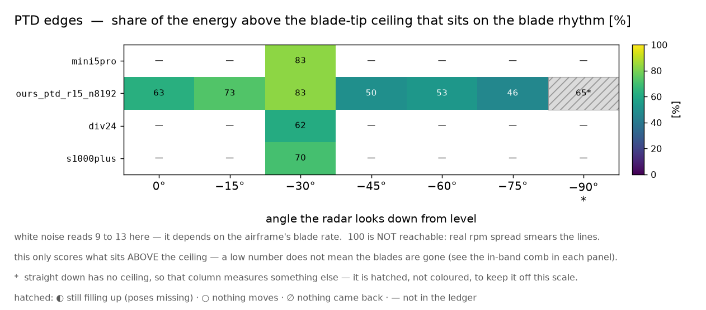

| 팔 | 무엇을 바꾼 판인가 | 앙각 | 리듬 몫[%] | 맵 · 대역 |
|---|---|---|---|---|
| `ours_ptd_mini5pro_r15_n8192` | 엔진 **우리 커널**(SBR+PO, 가림 있음) · 거리 15 m · 자세 8,192 개 · 격자 λ/12 · 모서리 보정(PTD) **켬** · 표적 DJI Mini 5 Pro(**기체 태그**) · 박자 183.333 Hz | −30 | 83 | [맵](../outputs/figures/atlas/07ptd__ours_ptd_mini5pro_r15_n8192__map.png) · [대역](../outputs/figures/atlas/07ptd__ours_ptd_mini5pro_r15_n8192__band.png) |
| `ours_ptd_r15_n8192` | 엔진 **우리 커널**(SBR+PO, 가림 있음) · 거리 15 m · 자세 8,192 개 · 격자 λ/12 · 모서리 보정(PTD) **켬** · 표적 DJI Matrice 4E · 박자 126.667 Hz | 0 −15 −30 −45 −60 −75 −90 | 63 73 83 50 53 46 65 | [맵](../outputs/figures/atlas/07ptd__ours_ptd_r15_n8192__map.png) · [대역](../outputs/figures/atlas/07ptd__ours_ptd_r15_n8192__band.png) |
| `ours_ptd_r15_n8192_div24` | 엔진 **우리 커널**(SBR+PO, 가림 있음) · 거리 15 m · 자세 8,192 개 · 격자 λ/24 · 모서리 보정(PTD) **켬** · 표적 DJI Matrice 4E · 박자 126.667 Hz | −30 | 62 | [맵](../outputs/figures/atlas/07ptd__ours_ptd_r15_n8192_div24__map.png) · [대역](../outputs/figures/atlas/07ptd__ours_ptd_r15_n8192_div24__band.png) |
| `ours_ptd_s1000plus_r15_n8192` | 엔진 **우리 커널**(SBR+PO, 가림 있음) · 거리 15 m · 자세 8,192 개 · 격자 λ/12 · 모서리 보정(PTD) **켬** · 표적 DJI S1000+(**기체 태그**) · 박자 148.9 Hz | −30 | 70 | [맵](../outputs/figures/atlas/07ptd__ours_ptd_s1000plus_r15_n8192__map.png) · [대역](../outputs/figures/atlas/07ptd__ours_ptd_s1000plus_r15_n8192__band.png) |

### 08. 계산을 촘촘히 하면 답이 변하나

> 우리 커널이 표면을 잘라 쓰는 격자를 λ/12 에서 λ/24 로 더 촘촘히 한 판이다. 답이 격자에 따라 흔들리면 그 폭이 곧 «이만큼 차이는 판정 불가» 라는 문턱이 된다.

팔 2 개 · 칸 8 개 · 그림 6 장 · 페이지 [`08_grid.html`](08_grid.html)

**⭐ 핵심 발견**

- 앙각 −15° 에서 팔 2 개를 늘어놓으면 리듬 몫이 **55.0 %**(`ours_r15_n8192_div48`) 에서 **72.8 %**(`ours_r15_n8192_div24`) 까지 벌어진다 — 폭 17.8 %p 는 ⚠이 짝이 바로 **밴드 21.8 %p 를 정의한 짝**이다 — 자기 자신과 대는 자리라 판정 대상이 아니다.
- 박자(날개가 시선을 지나가는 빠르기)를 잰 팔 2 개 중 **2 개**가 자기 기체의 예측 박자 ±2 % 안에 든다.
- 한 축만 다른 짝(`ours_r15_n8192_div24` ↔ `ours_r15_n8192`)을 같은 앙각 6 칸에서 빼면 리듬 몫 차이가 가장 큰 곳이 **21.8 %p**(평균 -5.5 %p) — ⚠이 짝이 바로 **밴드 21.8 %p 를 정의한 짝**이다 — 자기 자신과 대는 자리라 판정 대상이 아니다. 뺀 칸 1 개(잣대 퇴화 · 수를 낼 자격 없음)는 셈에서 제외했다. ⭐짝이 있는 팔은 2 개인데 그중 밴드 밖은 **0 개**다 — 여기 적은 것은 그중 **가장 큰 한 짝**일 뿐이니 주제 전체의 결론으로 읽지 마라(팔마다 링크를 달아 두었다).

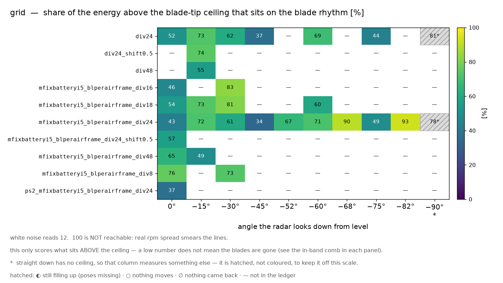

| 팔 | 무엇을 바꾼 판인가 | 앙각 | 리듬 몫[%] | 맵 · 대역 |
|---|---|---|---|---|
| `ours_r15_n8192_div24` | 엔진 **우리 커널**(SBR+PO, 가림 있음) · 거리 15 m · 자세 8,192 개 · 격자 λ/24 · 표적 DJI Matrice 4E · 박자 126.667 Hz | 0 −15 −30 −45 −60 −75 −90 | 52 73 62 37 69 44 81 | [맵](../outputs/figures/atlas/08grid__ours_r15_n8192_div24__map.png) · [대역](../outputs/figures/atlas/08grid__ours_r15_n8192_div24__band.png) |
| `ours_r15_n8192_div48` | 엔진 **우리 커널**(SBR+PO, 가림 있음) · 거리 15 m · 자세 8,192 개 · 격자 λ/48 · 표적 DJI Matrice 4E · 박자 126.667 Hz | −15 | 55 | [맵](../outputs/figures/atlas/08grid__ours_r15_n8192_div48__map.png) · [대역](../outputs/figures/atlas/08grid__ours_r15_n8192_div48__band.png) |

### 09. 파면 곡률이 결과를 바꾸나

> 조명을 구면파(가까운 곳에서 퍼져 나가는 파) 대신 평면파(무한히 먼 곳에서 오는 평평한 파)로 바꾼 판이다. 남은 신호가 파면의 휘어짐 탓인지 가린다.

팔 1 개 · 칸 1 개 · 그림 2 장 · 페이지 [`09_planewave.html`](09_planewave.html)

**⭐ 핵심 발견**

- 이 주제는 읽을 수 있는 칸이 하나뿐이다 — −90° 에서 리듬 몫 **58.6 %**(그 칸의 백색잡음 값 12.6 %). ⚠−90° 라 잣대가 퇴화한 자리이므로 «리듬이 있다»로 읽지 않는다.
- 박자(날개가 시선을 지나가는 빠르기)를 잰 팔 1 개 중 **1 개**가 자기 기체의 예측 박자 ±2 % 안에 든다.
- 이 주제에는 «한 축만 다른 짝 팔»이 없거나, 있어도 **비교할 수 있는 칸이 없다**(짝의 칸이 «되돌아온 것 없음»·«덜 참»·«잣대 퇴화» 중 하나면 뺀다). 깃발은 되돌아온 게 없는 칸 **0 개** · −90° 잣대 퇴화 칸 **1 개** · 덜 찬 칸 **0 개**다.

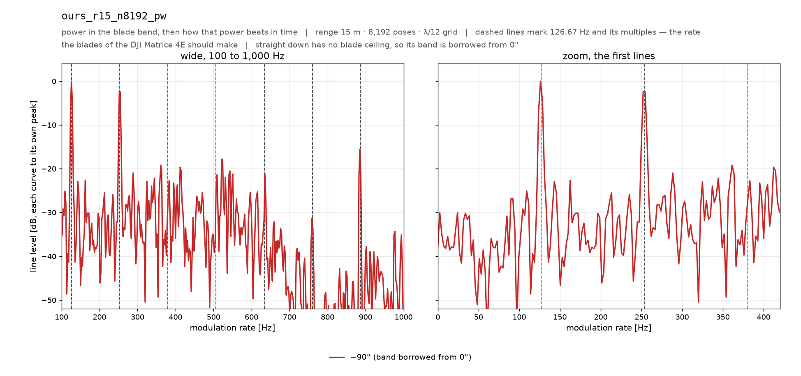

| 팔 | 무엇을 바꾼 판인가 | 앙각 | 리듬 몫[%] | 맵 · 대역 |
|---|---|---|---|---|
| `ours_r15_n8192_pw` | 엔진 **우리 커널**(SBR+PO, 가림 있음) · 거리 15 m · 자세 8,192 개 · 격자 λ/12 · 조명 **평면파** · 표적 DJI Matrice 4E · 박자 126.667 Hz | −90 | 59 | [맵](../outputs/figures/atlas/09planewave__ours_r15_n8192_pw__map.png) · [대역](../outputs/figures/atlas/09planewave__ours_r15_n8192_pw__band.png) |

---

## 3. 팔 이름 읽는 법

| 토막 | 뜻 | 없으면(기본값) | 쓰인 팔 |
|---|---|---|---|
| `ours` | 우리 커널(SBR+PO). 광선을 쏘아 맞은 면에서 되쏘는 셈을 직접 한다. 동체가 있어 날개가 **가려지는** 판이다. | — | 37 |
| `ours_free` | 같은 우리 커널인데 동체의 «면»만 빼서 **가림을 없앤** 대조군. 꼭짓점·상자·광선 격자는 그대로라 «동체가 막느냐» 하나만 갈린다. | — | 1 |
| `sionna` | Sionna RT 의 경로 추적기(PathSolver) 팔. | — | 84 |
| `p<N>` | 쏘는 광선 수. `p4000000000` = 40 억 발. | 거리로 정하는 규칙값 | 82 |
| `phys` | PathSolver 물리를 **전부 켠다** — 굴절 · 회절 · 모서리 회절. | 셋 다 끔 | 12 |
| `swR#D#E#F#` | 스위치를 비트로 직접 준 판. `R` 굴절 · `D` 회절 · `E` 모서리 회절 · `F` 확산 반사이고 `1` 이 «켬». 예 `swR1D0E0F1` = 굴절 + 확산 반사. | — | 20 |
| `stockdef` | PathSolver 를 **순정 기본값 그대로** — 굴절 켬 · 회절 끔 · 모서리 끔 · 확산 끔 · 깊이 3. 우리 «끔» 판과도 «켬» 판과도 다른 제3 의 조합이다. | — | 1 |
| `only<x>` | 스위치를 **하나만** 켠 판 — `onlyrefr` 굴절 · `onlydiffr` 회절 · `onlyedge` 모서리 회절 · `onlydepth3` 깊이 3. | — | 17 |
| `d<N>` | PathSolver 가 몇 번까지 튕긴 경로를 세는가(반사 깊이). | 물리를 켜면 3, 아니면 1 | 60 |
| `parts<…>` | 장면에 넣을 부품. `partsprop` = 프로펠러만 · `partsnoprop` = 프로펠러를 뺀 나머지. | 기체 전체 | 5 |
| `기체 태그` | 표적 기체를 바꾼 판 — `mini5pro` · `s1000plus`. ⚠박자와 날개끝 상한이 **함께** 바뀐다. | 원장 기본 matrice4e | 28 |
| `az<N>` | 방위각[°] — 드론을 옆에서 보는 각. `az45` = 45° 옆. | 0°(정면) | 17 |
| `r<N>` | 표적까지 거리[m]. `r15` = 15 m · `r30` = 30 m. | 옛 기본 10 m | 114 |
| `n<N>` | 찍은 자세 수(시간 방향 표본 수). `n8192` = 8,192 자세. | 원장 기본 4,096 | 115 |
| `div<N>` | 우리 커널이 표면을 자르는 격자 간격 λ/N. `div24` = λ/24. | 규약값 λ/12 | 3 |
| `ptd` | 우리 팔의 **모서리 회절 보정**(PTD) 켬. | 끔 | 8 |
| `pw` | **평면파** 조명 — 무한히 먼 곳에서 오는 평평한 파(구면파 대신). | 구면파 | 1 |

---

## 4. ⚠ 읽을 때 주의

1. **바로 아래(−90°)는 잣대가 망가진다** — 날개끝 상한이 0 Hz 라 «상한 위»가 전 대역이 된다. 그런 칸이 **32 개**이고 표에 «▲ 잣대 퇴화»로 적었다. 대역 그림은 0° 것을 빌려 그린다.
2. **엔진끼리 절대 세기를 비교하지 마라** — 우리 커널과 PathSolver 는 눈금이 다르다. 모양과 눈금에 무관한 수(리듬 몫 · 박자 · 박자÷예측)로만 말한다. 같은 팔 안 앙각끼리는 비교해도 된다.
3. **격자 흔들림 밴드 안이면 판정 불가** — 격자를 λ/12 → λ/24 로 조이기만 해도 리듬 몫 **21.8 %p** · 움직이는 전력 **3.86 dB** 가 움직인다(`outputs/grid_convergence_check.json`). 두 팔의 차이가 그 안이면 «차이가 있다»고 말할 수 없다. ⚠이 밴드는 **우리 커널의 격자 축**에서 나온 수다 — PathSolver 에는 그 축이 없으니 그쪽에 대는 것은 빌려 쓰는 것이다.
4. **거리가 다른 팔이 섞여 있고, 근접장은 기체마다 다른 자리에서 시작한다** — 이름에 `r` 토막이 없는 팔은 옛 기본 10 m 다. 원거리장 경계 2D²/λ 는 표적이 커지면 멀어진다:
   - DJI Matrice 4E — D 0.78 m · 경계 **14.08 m** · 이 원장의 거리 10 m · 15 m · 30 m · 60 m · 120 m · 240 m · 480 m → ⚠**10 m 는 근접장**(경계의 0.71 배)
   - DJI Mini 5 Pro — D 0.45 m · 경계 **4.79 m** · 이 원장의 거리 15 m · 30 m · 60 m · 120 m → 전부 밖(원거리장)
   - DJI S1000+ — D 1.92 m · 경계 **85.95 m** · 이 원장의 거리 15 m · 30 m · 60 m · 120 m → ⚠**15 m 는 근접장**(경계의 0.17 배) · **30 m 는 근접장**(경계의 0.35 배) · **60 m 는 근접장**(경계의 0.70 배)
5. **수를 낼 자격이 없는 칸이 14 개** — 되돌아온 게 없는 칸 9 개 · ⭐**아직 자세가 덜 찬 칸 2 개** · 움직이는 것이 없는 칸 3 개. 그 칸에는 잣대를 싣지 않았다. 덜 찬 칸은 빈 자세 자리의 0 채움이 스펙트럼을 PRF/2 · PRF/4 에 복제해 리듬 몫을 0 % 로 만든다 — **물리가 아니라 결측 자국**이라, 원장을 다시 병합해야 읽을 수 있다.
6. **자세 몇 개가 유난히 큰 칸이 61 개** — «⚡ 큰 자세» 딱지가 붙은 칸의 박자는 회전이 아니라 튄 자세들의 간격일 수 있다. 맵도 그 자세 하나가 색역을 다 먹는다. ⚠이 딱지는 **크기만** 잰 수다 — «혼자 큰가»는 아래 7 번이 잰다.
7. ⭐**자세 «하나»가 헤드라인을 끄는 칸이 3 개** — «⚑ 튐» 딱지. 그 칸에서 가장 큰 자세 하나를 이웃 평균으로 갈아 끼우고 헤드라인 넷(리듬 몫 · 빗살 대비 · 요동 전력 · 상한 위 몫)을 다시 잰 폭이 ① 죄 없는 자세 12 개·둘째 자세를 같은 방법으로 갈아 끼웠을 때보다 **116배** 넘게 크고 ② 그 앙각의 **격자 산포 밴드**보다 크면 «튐»이다.
   - `sionna\_p4000000000\_onlydepth3\_r15\_n8192` −60° — 자세 하나(#3399)가 격자 밴드보다 크게 헤드라인을 움직인다: 리듬 몫 +54%p > 격자밴드 16%p (3.4 배) · 쏠림 15534× · 요동 전력 -0.146dB > 격자밴드 0.02dB (7.3 배) · 쏠림 1046× · 빗살 대비 +20.9dB > 격자밴드 4dB (5.2 배) · 쏠림 2888×
   - `sionna\_phys` −15° — 자세 하나(#3195)가 격자 밴드보다 크게 헤드라인을 움직인다: 리듬 몫 +30%p > 격자밴드 0.1%p (299.7 배) · 쏠림 6667× · 요동 전력 -10.8dB > 격자밴드 1.31dB (8.2 배) · 쏠림 3301× · 빗살 대비 +16.3dB > 격자밴드 4.1dB (4.0 배) · 쏠림 403× · 상한 위 몫 -20.5%p > 격자밴드 12.5549%p (1.6 배) · 쏠림 933×
   - `sionna\_phys` −30° — 자세 하나(#2505)가 격자 밴드보다 크게 헤드라인을 움직인다: 빗살 대비 +8.77dB > 격자밴드 4.6dB (1.9 배) · 쏠림 216×
   - «◱ 자세 하나 쏠림(밴드 안)» 9 개 — 끌긴 하는데 폭이 밴드 안이라 **읽기는 안 바뀐다**.
   - «⌗ 덜 찍힌 플래시» 40 개 — ⭐**튐이 아니다.** 진짜 날개 플래시가 **한 표본 폭**으로 찍힌 것이다(참 신호가 표본 간격보다 좁다). 고칠 곳은 그 칸이 아니라 **표집**이고, 그 칸의 «상한 위 몫·빗살 대비» 인용에는 그 단서가 필요하다.
   - «◈ 경계 — 대조군 추첨에 흔들림» 6 개 — 쏠림의 분모가 «죄 없는 자세 12 개의 **최댓값**»이라 어느 12 개를 뽑느냐에 등급이 걸린다. 중앙값 대조군으로 다시 재서 판정이 갈리면 이 딱지를 붙였고, 감식 원장과 등급이 갈린 칸 8 개에는 그쪽 등급도 함께 적었다 — «둘 중 하나가 틀렸다»가 아니라 «문턱에 걸터앉아 있다»는 뜻이다.
   - ⛔**깃발이 떴다고 자동으로 버리지 마라** — 뜻은 «이 수는 자세 하나에 걸려 있으니 그 자세를 열어 보라»이지 «틀렸다»가 아니다. 로터가 시선과 맞는 순간의 **진짜 정반사 플래시**도 이렇게 보인다. 그래서 크기(최대÷중앙)는 등급에 안 쓰고 되풀이·이웃·영향으로만 판정한다.
   - 등급 분포 정상 277 · 주의 55 · 퇴화 14 · 튐 3. 문턱 출처 `outputs/outlier\_census\_0816.json` (원장 349 행) · 밴드 `benchmark/depth\_axis\_verdict\_0816.py`.

### 아직 못 고친 것

- **덜 찬 칸 2 개의 참값** — 원장 재병합이 필요하다. 세 칸 중 둘은 자세가 뭉텅이로 빠져 «0 을 걷어내고 다시 재는» 길도 없다(균일 표본이 아니다).
- **주제 분류가 아직 이름 토막으로 거리를 본다** — `_r` 토막이 없는 10 m 옛 팔이 «기본 엔진» 주제에 남아 있다. 안전장치는 위의 거리 표와 그림 속 거리 라벨이다.
- **맵은 패널마다 자기 최댓값으로 밝기를 맞춘다** — 거리·세기는 그림에서 못 읽는다.
- **리듬 몫의 창 반폭은 8 Hz 고정** — 정의를 유지한 대가로 100 은 도달 불가다.
- **박자는 전 구간, 맵은 20~80 ms** — 같은 상자의 두 수가 다른 구간에서 나왔다.

---

## 5. 다시 굽는 법

```bash
# ① 그림(원장이 바뀌었을 때만)
PYTHONPATH=src /workspace/.venvs/py312/bin/python benchmark/build_md_atlas.py
# ② 이 갤러리
/workspace/.venvs/py312/bin/python benchmark/build_atlas_gallery.py
```

그림은 **복사하지 않는다** — `../outputs/figures/atlas/` 를 상대경로로 걸 뿐이라 저장소가 두 배로 커지지 않는다. 원장이 그림보다 새로우면 페이지 맨 위에 «낡음» 띠가 뜬다.
