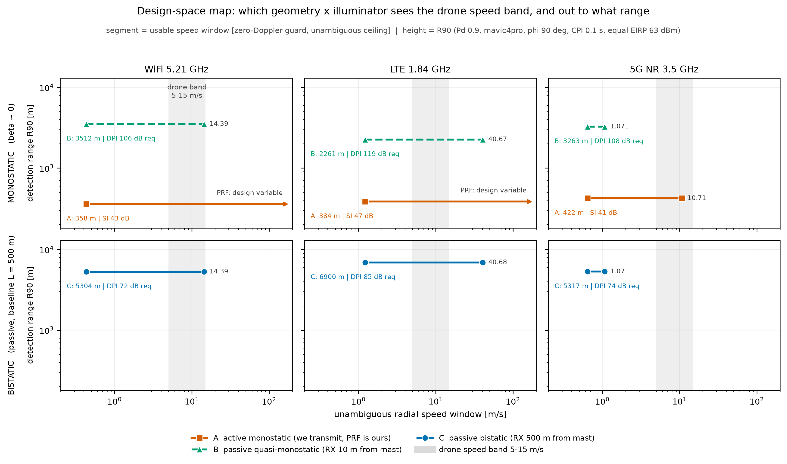

# 기하 × 조명원 설계공간 지도 — 2026-07-31

> ⚠⚠ **2026-07-31 스냅숏이다.** 그 뒤 `RETRACTION_LOG.md` 가 아래 여러 줄을 무효화했다 —
> **R14**(φ 스윕: 「최대 23.17/23.2 dB」는 φ 가 아니라 **스윕하지 않은 고도차 Δz = 35 m** 의
> 성질이다. φ 의존은 사실상 없고 **φ=90° 가 세 팔 모두 최소**) · **R11**(공통모드 기울기
> 0.2462 는 15 전역 적합의 **평균**이고 국소는 0.049~0.357 로 **7.2 배**. 순위불변성은
> 발견이 아니라 **항등식**) · **R3**. ⛔이 문서의 절대 수치를 인용하기 전에 그 셋을 먼저 읽는다.
>
> ⚠**이 문서는 지금 다시 구울 수 없다** — `benchmark/geometry_benchmark.py` 가 읽는
> `outputs/report13_sigma_grid.json` 이 `multistatic` 블록을 잃어서(2026-08-10 라운드에
> 다시 구워지며) `bisector_approximation_error_by_beta` 가 비고 빌드가 `KeyError: '45'` 로
> 멈춘다. 빌더 쪽 문안은 2026-09-04 에 고쳐 뒀고, 아래 본문은 그때까지 **손으로** 맞춰 둔다.

> 벤치마크를 **기하(모노/바이) × 조명원(WiFi/LTE/5G)** 2×3 으로 세우고, 기존 주장 18개를
> 그 지도 위에서 다시 판정한다. 규격은 [`PAPER_SPEC.md`](PAPER_SPEC.md) §0,
> 서술 규약은 [`REBUILD_2026-07-30.md`](REBUILD_2026-07-30.md) §5 를 따른다.

```
┌─ 한 일 ────────────────────────────────────────────────────────────────┐
│ 기하를 결과에서 빼내 축으로 올리고, 6칸 지도를 채운 뒤 주장 18개를 그    │
│ 지도 위에서 재판정하고 새 주장 4개를 세웠다.                            │
├─ 결과 ─────────────────────────────────────────────────────────────────┤
│ 축 크기: 기하 0.441 dB · 조명원 4.97 dB · 상호작용 0.11 dB · 간섭 47.1 dB │
│ 무모호 속도 바닥은 기하와 무관하다 — 세 밴드 전부 차이 0 m/s.        │
│ 속도창 동적범위 = M/(2·bins) 로 기하가 소거된다 — WiFi·LTE 33.33배, 5G 1.667배. │
│ 판정: both 13 · monostatic only 3 · passive only 1 · bistatic only 1 · neither 4.       │
│ C16(자세분해 σ)이 바이에서 drop 이고 모노에서 선다 — 지위가 오른 유일한 주장. │
├─ 방법 ─────────────────────────────────────────────────────────────────┤
│ 모노 팔은 `freespace_scene.fs_params` 를 TX=RX 로 부른 결과다 — 새 기하   │
│ 코드가 없다. σ 는 같은 격자를 β=0 으로 조회한다(모노 후방산란이 원래 우리 │
│ 생산 경로다). 문턱·Pfa 교정·듀티 규약은 두 팔에 같은 값을 쓴다.          │
├─ 재현 ─────────────────────────────────────────────────────────────────┤
│ PYTHONPATH=src:benchmark ~/.venvs/py312/bin/python benchmark/geometry_grid.py   (0.8 s)
│ PYTHONPATH=src:benchmark ~/.venvs/py312/bin/python benchmark/mono_link.py       (16.8 s)
│ PYTHONPATH=src:benchmark ~/.venvs/py312/bin/python benchmark/geometry_benchmark.py (2.4 s)
│ → outputs/geometry_benchmark.json · outputs/figures/geometry_benchmark_map.png │
├─ 앞 편에서 ────────────────────────────────────────────────────────────┤
│ v_max 법칙과 탈출구 6판정(`refrate_law.json` · `vmax_hardening.json`),    │
│ 격자 규약과 함정 10개(`geometry_grid.json`), 모노 링크버짓(`mono_link.json`).│
└────────────────────────────────────────────────────────────────────────┘
```

---

## 1. ⭐ 지도 — 6칸이 각각 무엇을 보는가

2 기하행(모노/바이) × 3 조명원 = 6 칸. 모노 행에는 통제가 다른 두 주체 A(능동)·B(패시브 준모노)가 함께 살고, 지도는 둘을 각각의 줄로 적는다.

| 기하 | 조명원 | 구성 | 송신 | 검지거리 R90 | 무모호 v_max | 사용가능 속도창 | 5~15 m/s 커버 | 대가 |
|---|---|---|---|---:|---:|---|---:|---|
| monostatic | WiFi 5.21 GHz | **A** | 우리(센서가 곧 송신기) | 357.7 m | 설계변수 | 0.432 → 자유 m/s | 설계 선택 | SI 42.9 dB 상승 (요구 152.9 · 실측 최선 100) |
| monostatic | WiFi 5.21 GHz | **B** | 남(사업자/AP) | 3512 m | 14.39 m/s | 0.432 → 14.39 m/s | 94 % | DPI 요구 106.2 dB (부여 90 → 상승 7.1 dB) |
| monostatic | LTE 1.84 GHz | **A** | 우리(센서가 곧 송신기) | 383.8 m | 설계변수 | 1.22 → 자유 m/s | 설계 선택 | SI 47.1 dB 상승 (요구 157.1 · 실측 최선 100) |
| monostatic | LTE 1.84 GHz | **B** | 남(사업자/AP) | 2261 m | 40.67 m/s | 1.22 → 40.67 m/s | 100 % | DPI 요구 119.3 dB (부여 90 → 상승 19 dB) |
| monostatic | 5G NR 3.5 GHz | **A** | 우리(센서가 곧 송신기) | 421.6 m | 10.71 m/s | 0.642 → 10.71 m/s | 57 % | SI 41.1 dB 상승 (요구 151.1 · 실측 최선 100) |
| monostatic | 5G NR 3.5 GHz | **B** | 남(사업자/AP) | 3263 m | 1.071 m/s | 0.642 → 1.071 m/s | 0 % | DPI 요구 107.8 dB (부여 90 → 상승 8.4 dB) |
| bistatic | WiFi 5.21 GHz | **C** | 남(사업자/AP) | 5304 m | 14.39 m/s | 0.432 → 14.39 m/s | 94 % | DPI 요구 72.18 dB (부여 90 → 상승 0.0072 dB) |
| bistatic | LTE 1.84 GHz | **C** | 남(사업자/AP) | 6900 m | 40.68 m/s | 1.22 → 40.68 m/s | 100 % | DPI 요구 85.36 dB (부여 90 → 상승 0.15 dB) |
| bistatic | 5G NR 3.5 GHz | **C** | 남(사업자/AP) | 5317 m | 1.071 m/s | 0.643 → 1.071 m/s | 0 % | DPI 요구 73.77 dB (부여 90 → 상승 0.01 dB) |

⟨`outputs/geometry_benchmark.json : map.cells`⟩ · 규약: mavic4pro · φ=90° · CPI 0.1 s · G1 점유 · 등-EIRP 63 dBm · 패시브 소거 90 dB · 능동 SI 100 dB(Barneto 실측)

**A 행의 '설계변수' 가 어디까지 가는가** — 자체 파형을 설계하면 상한은 거리모호가 정한다 (v·R = c·λ/8, Skolnik). 각 칸의 R90 에서 A-wifi 6029 m/s · A-lte 1.588e+04 m/s · A-nr 7613 m/s 로, 드론대 5~15 m/s 보다 자릿수가 크다. 즉 A 행을 묶는 것은 거리모호가 아니라 **규격이 정한 기준신호 천장**(5G CSI-RS 500 Hz → 10.71 m/s)이다.

**점유 규약** — 지도는 여섯 칸 모두에 G1(상시)을 쓴다. A 행은 자기 파형을 만재로 보낼 수 있으므로 G1 은 A 를 벌하는 규약이고, 그 벌점은 자기간섭 한계에서 상쇄된다 — EIRP 를 53 dB 올려도 A 의 R90 은 1.014배 움직이고 패시브 C 는 14.88배 움직인다 ⟨`mono_link.json : eirp_ladder_under_interference`⟩. 에코와 잔류가 함께 커지기 때문이고, 점유도 같은 방식으로 상쇄된다.

**절대 R90 은 소거깊이에 매달린다** — 지도의 세로축을 인용할 때 이 표를 함께 읽는다.

| 행 | 소거깊이 | R90 (LTE) | 깊이의 출처 |
|---|---:|---:|---|
| A 능동 모노 | 100 / 120 / 141 dB | 100 dB → 383.8 m · 120 dB → 1437 m · 141 dB → 4632 m | 100 dB = Barneto 2019 실측 · 141 dB = break-even |
| C 패시브 바이 | 40 / 60 / 90 dB | 40 dB → 867.1 m · 60 dB → 2837 m · 90 dB → 6900 m | 40~90 dB = `freespace_link.n0_dpi` 선언값(근거문서 없음) |

A 행은 깊이 100 → 141 dB 에서 12.1배 움직이고, C 행은 90 → 40 dB 에서 0.126배 움직인다 ⟨`mono_link.json : depth_matrix`⟩. 지도의 **상대비**가 절대값보다 단단하다.



**그림 1.** Which geometry x illuminator combination measures the drone speed band unambiguously, and out to what range?

### 1.1 속도창의 동적범위는 기하와 무관하다

v_max/v_guard = PRF/(2·bins·Δf_d) = M/(2·bins) — β·δ 가 분자·분모에서 똑같이 소거된다

| 밴드 | PRF | M | 가드 하한 v_guard | 무모호 상한 v_max | 동적범위 | 닫힌형 M/(2·bins) |
|---|---:|---:|---:|---:|---:|---:|
| WiFi 5.21 GHz | 1000 Hz | 100 | 0.432 m/s | 14.39 m/s | 33.33배 | 33.33배 |
| LTE 1.84 GHz | 1000 Hz | 100 | 1.22 m/s | 40.67 m/s | 33.33배 | 33.33배 |
| 5G NR 3.5 GHz | 50 Hz | 5 | 0.642 m/s | 1.071 m/s | 1.667배 | 1.667배 |

수치와 닫힌형의 최대 차이 2.22e-16 ⟨`…: usable_speed_window`⟩. ⭐ 기하는 속도창을 **통째로 민다**. 완화 1/cos(β/2) 가 상한과 하한에 똑같이 곱해지므로 폭은 M/(2·bins) 로 고정이다 — WiFi·LTE 33.33배, 5G 1.667배 — 기하는 창을 밀고 CPI 가 폭을 정한다.

### 1.2 두 기하의 블라인드·접힘 비율

| 밴드 | 속도 | 바이(L=500 m) blind_hard | 모노 blind_hard | Δ | 바이 alias | 모노 alias | Δ |
|---|---:|---:|---:|---:|---:|---:|---:|
| WiFi 5.21 GHz | 5 m/s | 0.053 | 0.053 | +0.000 | 0.000 | 0.000 | +0.000 |
| WiFi 5.21 GHz | 15 m/s | 0.019 | 0.019 | +0.000 | 0.181 | 0.181 | +0.000 |
| LTE 1.84 GHz | 5 m/s | 0.158 | 0.158 | +0.000 | 0.000 | 0.000 | +0.000 |
| LTE 1.84 GHz | 15 m/s | 0.053 | 0.053 | +0.000 | 0.000 | 0.000 | +0.000 |
| 5G NR 3.5 GHz | 5 m/s | 0.636 | 0.636 | +0.000 | 0.864 | 0.864 | +0.000 |
| 5G NR 3.5 GHz | 15 m/s | 0.633 | 0.639 | +0.006 | 0.953 | 0.953 | +0.000 |

같은 장면점·같은 CPI 에서 두 기하의 차이가 blind 0.00556 · alias 0 다. 바이 팔은 `freespace_scene.blind_fractions` 를 최대 오차 0 로 재현한다 ⟨`…: blind_and_fold`⟩.

---

## 2. ⭐ 주장 재판정 — 어느 기하에서 서는가

판정 기준: 이 주장을 두 기하 행 모두에서 인용할 수 있는가. 'neither' 는 틀렸다는 뜻이 아니라 이 논문에서 주장하지 않는다는 뜻이다.

| # | 주장 | 기하 판정 | 근거 | 할 일 |
|---|---|---|---|---|
| C0 | v_max = λ·PRF_ref/4 — 상시 기준신호의 반복률이 무모호 속도를 정한다 | **both** | abs_diff_ms 0/0/0 · relief_at_beta45_x 1.082 | ⭐ 문장에 '두 기하의 최악값' 한 줄을 넣는다. 검지 한계에서는 β 중앙 2.92° 라 그 최악값이 곧 실제값이다 |
| C0b | 속도 동적범위 v_max/v_guard 는 기하와 무관하다 (신규) | **both** | closed_form M/(2·guard_bins) · wifi_lte_x 33.33 | 지도의 '사용가능 속도창' 열이 이 항등식 위에 선다 |
| C1 | 탈출구 6판정 — (a)(b)(c) 폐쇄 · (d)(e)(f) 부분완화 | **both, 재배치 2건** | escapes 6항 · active_prf_gain_x 10 | (e) 를 기하 축으로 옮기고, 7번째 항 'PRF 통제권(구성 A 전용)' 을 추가한다 |
| C2 | 접힘과 블라인드는 다른 양이다 — CPI 는 검출을 되살리고 모호는 못 고친다 | **both** | max_abs_delta_blind_hard 0.005556 · max_abs_delta_alias_frac 0 | 없음 — 두 행에 같은 표를 쓴다 |
| C3 | 인프라 서사 — LTE CRS → 5G SSB 로 v_max 가 38.0배 준다 | **both** | v_max_ratio 37.98 · prf_ratio 20 | 없음 (TS 원문 대조는 별건으로 남는다) |
| C4 | CFAR 를 경험 Pfa 로 교정 | **both** | runtime_s 2717 · snr90_db 11.86 | 없음 — 두 팔이 같은 교정을 그대로 공유한다 |
| C5 | 공통모드 σ 불변성 — dR_dB/dσ_dB = 1/4 | **both** | slope_mean 0.246 ⚠15 전역 적합의 **평균**이다 — 셀별 0.223~0.256, 국소 0.049~0.357(**7.2배**). 4 자리 단일값은 거짓 정밀이다(R11) · monostatic_dsigma_db 0 | ⚠**항등식이지 발견이 아니다** — 세 모드가 같은 σ/R⁴ 사슬을 쓴다. 국소 최대 0.357 은 이론 상한 0.25 를 넘으므로 σ 격자 고도 조회의 **계단 아티팩트**다(R11) |
| C6 | 조명원 대가 원장 — 점유 · λ² · ΔR_b · 듀티 | **both** | duty_db  · duty_pair_gaps_db -12.8/3.18/16 | ⚠ 듀티는 여전히 R90 경로에서 호출되지 않는다 — §5 결함 D2 |
| C7 | 승자 주장 — LTE CRS 가 최선의 상시 조명원 | **both (강화됨)** | ranking_same_across_placements σ 격자를 가진 7 기체 전부에서 조명원 순위가 네 배치에 걸쳐 동일하다(True).  · winner_margin_db_aspect_avg_anchored 8.313 | σ 축 문장에 '네 배치에서 순위 동일' 을 근거로 추가한다 |
| C8 | 같은 CPI 12.05배 벌점 | **both (조건부)** | condition WiFi VHT-LTF 1 kHz 트래픽 가정 · spec_guaranteed_ambient_hz 9.766 | 없음 — 조건절과 함께 지지 수치로만 쓴다 |
| C9 | 5G 커버리지 = 0, 전 헤딩 블라인드 | **neither** | — | PAPER_SPEC §2 지시대로 유지 |
| C10 | 버스트 내부 ↔ 버스트 간 교환관계 | **both** | intra_burst symbol_s 3.57e-05/symbols_per_ssb 4 | 없음 — 신규성 문단 필수 부품 |
| C11 | 설정 의존성 — SSB 주기 {5..160} ms → 4.28 ~ 0.134 m/s | **passive only (B·C)** | passive_cells 2항 · active_ceiling_prf_hz 500 | '패시브 셀에서' 라는 조건절을 붙인다 |
| C12 | 부위별 재질 + 광선 가림 (방법) | **both, 모노에서 더 직접적** | kernel_vs_analytic_po_db 0.2006 · monostatic_dsigma_db 0 | 모노 행에 '근사 없음(Δσ=0)' 을 표기한다 |
| C13 | 3자 순위(1·2·3위) | **neither** | n_distinct_orders 3 | drop 유지. 자세평균 순위(C7)로 대체한다 |
| C14 | 절대 검출거리 (R90 km 급) | **neither, 모노에서 조건이 하나 늘었다** | R90_at_100dB_m 383.8 · R90_at_141dB_m 4632 | drop 유지. 지도에는 상대비(배율)만 싣는다 |
| C15 | 드론 RCS 정확도 | **neither** | — | drop 유지 |
| C16 | 자세분해 바이스태틱 σ | **monostatic only ⭐** | bisector_rms_median_at_beta45_db 7.473 · bisector_p95_max_at_beta45_db 20.04 | ⭐ 모노 행에서는 **자세분해 σ 를 주장한다**(커널 0.201 dB). 바이 행은 drop 유지 |

**새로 생긴 주장**

| # | 주장 | 기하 판정 | 할 일 |
|---|---|---|---|
| N1 | 기하의 링크버짓 기여는 닫힌형 20log10(R_조명원/R_센서) 이고 검지 한계에서 죽는다 | **both (기하 축 그 자체)** | 지도 캡션에 '기하 축은 d ≲ 2L 에 산다' 를 적는다 |
| N2 | 모노스태틱이 실제로 사는 것은 PRF 통제권 하나다 — 5G 에서 10배 | **monostatic only** | ⚠ 500 Hz CSI-RS 는 **망이 설정하면 패시브도 받는다** — 모노 전용 레인은 데이터 심볼(X[m,n] 기지)이다. 경계는 '기준신호만 vs 전 파형' 이다 |
| N3 | 자기간섭이 모노 행의 검지거리를 정한다 — 실측 최선 100 dB 에서 47.1 dB 잡음상승 | **monostatic only** | A 행에 SI 열을 상설한다 |
| N4 | 이격거리는 공짜 격리다 — L=500 m 패시브는 소거 28.3 dB 로 능동 100 dB 전단과 같은 잔류 | **bistatic only** | 원장을 '등가 베이스라인 L_equiv' 로 한 자에 놓는다 |

18개 + 신규 4개 중 both 13 · neither 4 · monostatic only 3 · passive only 1 · bistatic only 1. ⭐ 지위가 오른 것이 하나 있다 — C16 자세분해 σ 는 바이에서 drop 이고 모노에서 선다.

### 2.1 바닥은 기하와 무관하고 링크버짓은 기하에 매달린다

| | 무모호 속도 바닥 | 링크버짓 |
|---|---|---|
| 기하 의존 | 없음 — 모노 = 바이 β=0, 차이 0 m/s | 있음 — 20log10(R_조명원/R_센서). ⛔전 판의 「장면 최대 23.17 dB」는 **R14 가 무효화했다** — R90 동작점 ≤1.20 dB · d 중앙값 ≤3.10 dB, φ=90° 가 세 팔 모두 최소 |
| 바이스태틱에서 | 관대해진다 (β=90° 에서 1.414배) | φ 에 따라 부호가 뒤집힌다 |
| 검지 한계에서 | 완화 1.00032배 — 바닥이 곧 값 | 0.441 dB 로 죽는다 |
| 우리가 인용해온 값 | 1.07 / 14.39 / 40.67 m/s = **두 기하의 최악값** | φ=90° 단일 방위 — 재계산 대상 |

---

## 3. ⭐ 재프레이밍된 기여 — 서론에 그대로 넣는다

> **Geometry × Illuminator: A Controlled Benchmark of Monostatic and Bistatic Drone Sensing on WiFi, LTE and 5G NR**

**한 문장 기여**: 드론 센싱을 기하(모노/바이) × 조명원(WiFi/LTE/5G) 2×3 으로 통제 비교하고, 그 지도 위에서 무모호 속도가 상시 기준신호의 반복률로 결정된다는 것 — v_max = λ·PRF_ref/4 — 그리고 그 한계가 **PRF 를 고르지 못하는 쪽에만** 구속으로 작용한다는 것을 보인다.

우리는 기하와 조명원을 **서로 독립인 두 축**으로 세우고, 그 위에 통제 축(PRF 가 설계변수인가 주어진 값인가)을 세 번째로 얹는다. 세 축을 분리하면 각 축이 무엇을 정하는지가 수치로 갈린다 — 검지 한계에서 기하 0.44 dB · 조명원 4.97 dB · 상호작용 0.11 dB · 간섭 47.1 dB 다.

⭐ **무모호 속도의 바닥은 기하와 무관하다.** 모노스태틱은 바이스태틱의 β=0 특수해이고 두 값의 차이는 0 m/s 다. 바이스태틱은 β 가 커질수록 관대해진다(β=90° 에서 1.414배). 그래서 우리가 발표해온 1.07 / 14.39 / 40.67 m/s 는 **두 기하의 최악값**이며, 검지 한계(β 중앙 2.92°)에서는 그 최악값이 곧 실제값이다.

⭐ **링크버짓은 다르다.** 기하의 링크버짓 기여는 20log10(R_조명원/R_센서) 한 줄이고 장면 방위에 따라 부호가 뒤집힌다. ⛔**RETRACTION_LOG R14 가 무효화했다**(2026-08-03, φ 0~355° 72 점 실측) — 그 수는 φ 의 성질이 아니라 **스윕하지 않은 고도차 Δz = 35 m** 의 성질이고 단일 d 칸 값이다. φ 의존은 사실상 없다 — R90 span 0.48 %(≤0.083 dB)이고 **φ=90° 가 세 팔 모두 최소**다. R90 동작점 ≤1.20 dB · d 중앙값 ≤3.10 dB. 같은 항이 검지 한계(d ≈ 14L)에서는 0.44 dB 로 죽는다 — 기하 축은 근거리에 산다.

**통제 축이 왜 같은 법칙을 한쪽에만 구속으로 만드는가.** 능동 모노스태틱은 반복률을 고른다 — 3GPP sub-6 CSI-RS 천장 500 Hz 에서 v_max = 10.71 m/s 로 패시브 SSB 1.071 m/s 의 10배다. 패시브는 망이 정한 값을 받는다. 같은 식이 한쪽에서는 설계 여유이고 다른 쪽에서는 벽이다.

**LaSen(SenSys '26 게재)이 능동 모노스태틱 5G 칸을 차지한다.** 그 칸이 작동한다는 것을 실측으로 보였고, 탈출구로 반복률이 아니라 데이터 심볼(X[m,n] 기지)을 썼다. 그 칸이 서 있기 때문에 패시브 칸의 속도 한계가 실패가 아니라 **설계공간의 경계**가 된다.

⚠ **경계선을 정확히 긋는다.** 통제 축의 진짜 경계는 '모노 vs 패시브' 가 아니라 '기준신호만 쓰기 vs 전 파형 쓰기' 다. 500 Hz CSI-RS 는 망이 설정하면 패시브도 받고, 패시브도 복조·재변조로 전 파형 레인(1 kHz → 21.4 m/s)에 들어갈 수 있다. 모노스태틱이 공짜로 갖는 것은 그 레인의 **입장료**다.

**기여 다섯**

1. ⑴ 기하 × 조명원 2×3 통제 격자 — 무엇을 고정하고 무엇을 변하게 두는지를 함정 10개와 함께 못박는다
2. ⑵ 축 분리 정량 — 기하 0.44 · 조명원 4.97 · 상호작용 0.11 · 간섭 47.1 dB
3. ⑶ 상시 기준신호 12종 교차표준 표와 v_max 법칙, 그리고 그 바닥이 기하와 무관하다는 증명
4. ⑷ 탈출구 6 전수 판정 + 7번째(PRF 통제권)가 구성 A 에서만 열린다는 판정
5. ⑸ 간섭 원장을 한 축으로 — 등가 베이스라인 L_equiv 로 DPI 와 SI 를 한 자에 놓는다

**신규성 경계** — Rzewuski(NATO STO 2021)가 드론 바이스태틱 RCS → 커버리지 → 50 m 실외 검출을 이미 닫았다 — '최초' 류를 쓰지 않는다 · v_max = λ·PRF/(4cos(β/2)cosδ) 는 Chen et al. Applied Sciences 2024 가 먼저 냈다 · Abratkiewicz 2023 이 5G SSB 에 적용했다 · v·R = c·λ/8 은 Skolnik 의 고전 결과다

### 3.1 LaSen 을 정확히 놓는다

Q. Yang, Y. Dai, M. Li, Q. Huang, X. Chen, J. Zhang, G. Song, Q. Zhang, X. Tao, 'LaSen: Low-Altitude Drone Sensing with 5G-NR Signals', in Proc. ACM/IEEE SenSys '26, Saint Malo, France, May 2026, pp. 732-745. DOI 10.1145/3774906.3800504. (published)

| 항목 | LaSen | 우리 A-nr 칸 |
|---|---|---|
| 기하 | MONOSTATIC | 모노스태틱 (β≈0) |
| 검지거리 | 108 m (실측) | 421.6 m @ 63 dBm → 93.85 m @ 36.9 dBm |
| 최고 속도구간 | 14.6~20.2 m/s (기체 한계) | 규격 재활용 천장 10.71 m/s |
| 탈출구 | 데이터 심볼 + 2D-OMP 부표본 | PRF 통제권 |

자릿수 확인이다. 네 규약이 다른데도 두 값이 링크버짓 2.44 dB 안에 든다. 규약 차이 네 가지: 반송파 — LaSen 5.8 GHz 비면허 · 우리 A-nr 3.5 GHz · 표적 — LaSen Matrice 4E / Mini 4 Pro · 우리 mavic4pro · SI 처리 — LaSen 차폐판 + 정적배경 제거(격리 수치 미보고) · 우리 Barneto 실측 100 dB · 처리 — LaSen 2D-OMP 부표본 압축센싱 · 우리 정합필터 + 교정 CFAR.

- LaSen 의 탈출구는 반복률이 아니라 **데이터 심볼**이다 — X[m,n] 를 알아야 쓴다
- 그 대가는 트래픽이다 — 상용 gNB 실측에서 밀집구간이 전체의 5 % ⟨monostatic_prior.json : lasen.traffic_statistics_measured.dense_segment_fraction⟩
- ⭐ 경계는 '모노 vs 패시브' 가 아니라 '기준신호만 쓰기 vs 전 파형 쓰기' 다 — 패시브도 복조·재변조로 전 파형 레인에 들어간다(nr_recon 행 1000 Hz → 21.41 m/s)
- LaSen 은 상용 gNB 로 드론을 잰 적이 없다 — 드론 반사는 자체 USRP 만재 송신, 상용 gNB 는 RE 점유 마스크 추출에만 썼다

⭐ LaSen 은 A-nr 칸이 **작동한다는 게재 증거**다. 그 칸이 서기 때문에 B·C 칸의 속도 한계가 '실패' 가 아니라 **설계공간의 경계**가 된다.

---

## 4. ⚠ 생산 결함 둘을 지도에 넣는다

두 결함은 **둘 다 조명원 축**이다. 기하 축은 그대로 서고, 조명원 축은 WiFi ×0.425 · LTE ×1.11 · 5G ×0.395 로 움직인다 — LTE 의 우위가 커진다.

| 결함 | 무엇인가 | 영향 칸 | 기하 축 영향 | R90 배율 | 그러면 결정되는 것 |
|---|---|---|---|---|---|
| **D1** | 앵커가 리포트 계층에만 있고 생산 σ 사슬 밖에 있다 | 6칸 전부 — σ 사슬은 두 기하가 공유한다 | 0 | WiFi ×0.9 · LTE ×1.11 · 5G ×1.001 | 자세평균 승자 여유가 3.48 dB → 8.313 dB 로 오르고, 그때 비로소 현실 오차범위 5.013 dB 밖으로 나간다 |
| **D2** | 듀티 축이 정의만 되고 R90 생산경로 밖에 있다 | 6칸 전부 — 자원격자가 정하는 값이라 기하와 무관하다 | 0 | WiFi ×0.4727 · LTE ×1 · 5G ×0.3944 | 조명원 축의 LTE−5G 간격이 16.02 dB 늘고, 승자 여유가 21.15 dB 가 된다 |

**정정 지도** — 두 결함을 다 넣으면 검지거리가 이렇게 바뀐다.

| 칸 | 현재 R90 | 앵커 적용 | 앵커+듀티 | 총 배율 |
|---|---:|---:|---:|---:|
| A-wifi | 357.7 m | 321.9 m | 152.2 m | ×0.425 |
| A-lte | 383.8 m | 425.9 m | 425.9 m | ×1.11 |
| A-nr | 421.6 m | 422.1 m | 166.5 m | ×0.395 |
| B-wifi | 3512 m | 3161 m | 1494 m | ×0.425 |
| B-lte | 2261 m | 2509 m | 2509 m | ×1.11 |
| B-nr | 3263 m | 3267 m | 1289 m | ×0.395 |
| C-wifi | 5304 m | 4774 m | 2257 m | ×0.425 |
| C-lte | 6900 m | 7657 m | 7657 m | ×1.11 |
| C-nr | 5317 m | 5323 m | 2099 m | ×0.395 |

조명원 순위는 정정 전 lte > nr > wifi · 정정 후 lte > wifi > nr 다 ⟨`…: live_defects`⟩ — 승자 LTE 는 그대로이고 2·3위가 자리를 바꾼다. 두 결함을 넣으면 LTE 의 여유가 커진다.

---

## 5. 공백 목록과 검증 부담

1~5 는 합쳐 GPU 10분 + 문헌 4시간이고 그 안에 A 행의 최대 변수 두 개(위상잡음 레짐·EIRP 상한)가 닫힌다.

| 순위 | 할 일 | 비용 | 그러면 결정되는 것 | 기하 축이 두 배로 만드나 |
|---:|---|---|---|---|
| 1 | 듀티 축 배선 (결함 D2) | 패치 1줄 · GPU 0 · ~15 분 | 조명원 축이 16.02 dB 움직이고 승자 여유가 21.15 dB 가 된다 | 아니오 |
| 2 | SI 기준면·장면원점 규약 합치기 | GPU 0 · ~30 분 | mono_link.json 과 monostatic_scene.py 를 한 표에 인용할 수 있게 된다 (현재 SI 10.0 dB · 원점 250 m 차이) | 아니오 |
| 3 | 앵커를 생산 σ 사슬에 배선 (결함 D1) | GPU ~10 분 + 격자 재생성 | R90 이 밴드별 ×0.900~×1.110 움직이고 승자 주장이 현실 오차범위 밖으로 나간다 | 아니오 |
| 4 | 능동 EIRP 규제 상한 확정 (함정 T3) | 문헌 ~2 시간 | A 행 절대 R90 이 확정되고 등-EIRP 규약의 편향 방향이 닫힌다 | 아니오 |
| 5 | 송신기 위상잡음 스펙트럼 확정 | 문헌 ~2 시간 | ⭐ A 행 최대 변수 — 광대역 레짐이면 R90 384 m, 0-도플러 레짐이면 5306 m (13.8배) | 아니오 |
| 6 | φ 스윕을 σ·커버리지 산출물로 확장 | GPU ~1 시간 (φ 3점) ~ 4 시간 (φ 13점) | '기하는 링크버짓에 영향 없다' 가 φ=90° 의 산물인지 아닌지 (⛔함정 T1b 의 「최대 23.2 dB」는 R14 가 무효화했다 — φ 스윕 72 점에서 R90 span 0.48 %) | 예 |
| 7 | σ 격자 el 을 −75° 까지 확장 | GPU ~570 s × el 배수 ≈ 1 시간 | d ≲ 2L 근거리대(기하 축이 사는 곳)의 R90 을 신뢰할 수 있게 된다 | 예 |
| 8 | 실장 ECA 소거깊이 실측 | X410 캠페인 (1~2일) | C·B 행의 90 dB 가 선언값에서 실측으로 바뀐다. 40 dB 면 C 의 R90 이 6900 → 867 m 로 무너진다 | 아니오 |
| 9 | 능동 모노 실측 격리 100 dB 위 문헌 | 문헌 ~2 시간 | break-even 147.1 dB 까지의 41 dB 격차가 좁혀지는지 | 아니오 |
| 10 | E-ALIAS 실측 (접힘 시연) | 캠페인 1~2일 | 법칙의 실측 증거. 기하와 무관하므로 한 캠페인이 두 행을 함께 산다 | 아니오 |

### 5.1 기하 축을 얹은 값은 얼마인가

| 검증물 | 기하 의존 | 왜 | 추가 비용 |
|---|---|---|---|
| Pfa 교정 (2717 s MC) | 아니오 | 검출기 규약은 β 를 안 탄다 — 두 팔이 같은 문턱·같은 배율 | 0 |
| SBR 커널 ↔ 해석 PO (0.201 dB) | 아니오 | 후방산란 기준 검증이라 모노에 더 직접 적용된다 | 0 |
| σ 격자 (570 s GPU) | 아니오 | ⭐ 모노 팔이 **같은 격자**를 β=0 으로 조회한다 — 새 RCS 계산 0 | 0 |
| 링크버짓 → R90 | 예 | fs_params 를 TX=RX 로 다시 부른다 | 16.82 s CPU (완료) |
| 블라인드·접힘 비율 | 예 | 같은 함수를 두 기하로 부른다 | 이 파일에서 완료 |
| 간섭 원장 | 아니오 | ⚠ 두 배가 아니라 **다른 물리** — DPI 와 SI 는 별개 항이고 각각 근거가 필요하다 | 문헌 1건 신규 (Barneto 2019) |
| φ 스윕 | 예 | 기하 비교는 φ 를 반드시 쓸어야 한다 (함정 T1b) | 산출물마다 ×3 ~ ×13 |
| 기하 항등식 회귀 | 예 | 모노 = 바이 β=0 · 간섭 끈 R90 재현 | 완료 (0 m · 0 m/s) |

⭐ 기하 축을 두 배로 만든 검증은 8개 중 4개이고, 그 4개의 실제 비용은 CPU 17.61 s · GPU 0 이다. 가장 비싼 검증(σ 격자 570 s GPU · Pfa 2717 s MC)은 정확히 두 배가 되지 않는다 — σ 는 원래 모노고 Pfa 는 기하 무관이기 때문이다.

남는 진짜 비용은 두 가지다 — φ 스윕(산출물마다 ×3~13)과 간섭 원장의 두 번째 물리(SI). 앞의 것은 GPU, 뒤의 것은 문헌이다.

### 5.2 좁혀야 한다면 — 자르는 순서

⭐ §5 의 3번(모노+바이 → 바이 단독)을 **가장 나중에** 친다. 모노 팔의 한계비용이 CPU 17.6 s · GPU 0 이고, 그 대가로 게재 대조군(LaSen)과 통제 축을 얻기 때문이다.

| 순위 | 자를 것 | 아끼는 것 | 잃는 것 | 규격 항 |
|---:|---|---|---|---|
| 1 | σ 격자 5기체 → 1기체 (mavic4pro) | GPU 570 s → 114 s | 기체 일반화 문장을 뺀다 | §5-5 |
| 2 | φ 13점 → 3점 {0°, 90°, 180°} | φ 의존 산출물 ×13 → ×3 | φ 중앙값 통계가 3점 평균으로 거칠어진다. ⛔「absmax 23.2 dB」를 근거로 들던 문장은 R14 가 무효화했다 — φ 스윕 72 점에서 R90 span 0.48 % 이고 φ=90° 가 세 팔 모두 최소다 | 이번 라운드 신규 축 |
| 3 | 근거리대(d ≲ 2L) 를 범위에서 뺀다 | σ 격자 el 확장(−75°) 이 통째로 빠진다 | 기하 축의 링크버짓 항이 0.61 dB 로 고정된다 — 그러면 기하 행의 내용은 간섭항과 통제권 둘로 좁혀진다 | §5-2 (실측이 닿는 거리대) |
| 4 | 기체 7종 → 실측 2종 + 대조군 2종 | 메쉬·격자 작업 | 크기 전이 문장이 약해진다 | §5-1 |
| 5 | 모노+바이 → 바이 단독 | CPU 17.6 s | ⛔ LaSen 대조군과 통제 축을 통째로 잃는다 — 재프레이밍의 목적이 사라진다 | §5-3 |

**절대 자르지 않는 것**: v_max 법칙과 12종 교차표준 표 · 탈출구 6판정 · Pfa 교정 · ⭐ 신규: 통제 축(A 는 PRF 를 고르고 B·C 는 망이 준 값을 받는다)

⭐ 한 행만 남겨야 하면 **바이스태틱(C)** 을 남긴다 — 실측 장비(X410 4RX)와 논문 헤드라인이 거기 서 있고, 모노 행은 A 의 절대 R90 이 선언 SI 깊이에 매달려 있다.

---

## 다음 단계

| 다음에 할 일 | 그러면 결정되는 것 | 어디서 |
|---|---|---|
| 듀티 축을 R90 경로에 배선한다 (D2) | 조명원 축이 16.02 dB 움직이고 승자 여유가 21.15 dB 가 된다 | `src/experiment_freespace_range.py` · 패치는 `mono_link.json : handoff.patch_requests[1]` |
| 앵커를 생산 σ 사슬에 배선한다 (D1) | R90 이 밴드별 ×0.900~×1.110 움직이고 승자 주장이 현실 오차범위 밖으로 나간다 | `src/experiment_freespace_sigma.py` |
| SI 기준면과 장면원점 규약을 정한다 | `mono_link.json` 과 `monostatic_scene.py` 를 한 표에 인용할 수 있게 된다 | `mono_link.json : handoff.two_conventions_to_settle` |
| 송신기 위상잡음 스펙트럼을 문헌으로 못박는다 | A 행 R90 이 384 m 인지 5306 m 인지 정해진다 | Barneto 2019 후속 |
| φ 를 σ·커버리지 산출물로 확장한다 | 기하 축의 크기가 φ=90° 의 산물인지 정해진다 | `src/experiment_freespace_sigma.py` |
| 지도를 03·05편에 싣는다 | 논문 IV·VI 절의 그림이 확정된다 | `src/make_report03_illuminators.py` · `make_report05_results.py` |

