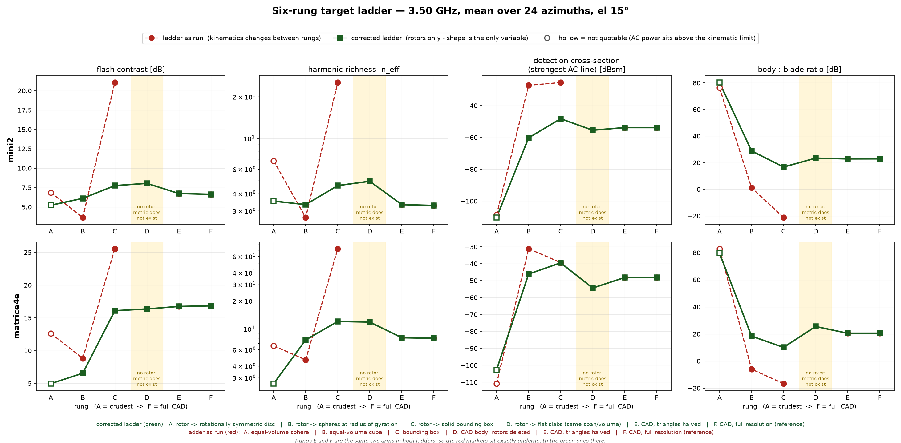
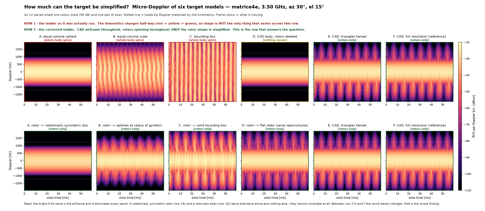

# 표적 사다리 — «드론을 얼마나 거칠게 그려도 되나»

*생성: 2026-08-04T14:34:54 · 생성기: `benchmark/report16_synthesis.py` · 모든 숫자는 `outputs/report16_synthesis.json` 에서 계산되어 꽂힌 값이다(손입력 0).*

---

## 0. 한 문단 결론

**판정: PREMATURE** (적대검증 3 렌즈 중 3 개가 PREMATURE — 결론을 그 수준으로 낮춰 적는다). 표적을 얼마나 단순화해도 되는가에 대한 잠정 답은 **«구조가 있느냐 없느냐» 까지는 반드시 지키고, 그 위의 정밀도는 거의 지키지 않아도 된다** 는 것이다. 진짜 비행 조건에서 프로펠러만 갈아 끼운 교정 사다리를 보면, 회전대칭 원판으로 바꾸는 순간 호버 표적의 검출 단면적이 54~56 dB 무너지지만, 삼각형 수를 절반으로 줄이는 것은 0.01 dB(템플릿 손실 0.00 dB)로 사실상 공짜이고, 날개를 평판 두 장으로 바꾸는 고전 모델조차 6.2 dB 안에 든다. 즉 «모양의 유무» 는 수십 dB 를 가르고 «모양의 정밀도» 는 한 자릿수 dB 안에서 논다. ⚠ 다만 이 답을 아직 결론이라고 부를 수 없는 이유가 7 가지 있고(§8), 그중 둘이 치명적이다 — 우리 커널에 가림(그늘)이 없어서 «프리미티브가 CAD 보다 배음이 풍부하다» 는 이 라운드의 헤드라인 대조가 그늘을 넣는 것만으로 네 구석 전부 부호가 뒤집히고, 사다리 여섯 단이 운동학을 섞어 써서 인용되는 «정육면체 대 메쉬» 차이의 55~74 % 가 형상이 아니라 «무엇이 도는가» 다. ⚠⚠ 그리고 이 모든 숫자 위에 하나가 더 얹힌다 — **마이크로도플러를 만드는 프로펠러 날개(폭 13.78 mm = 3.5 GHz 에서 파장의 0.161 배)는 우리 PO 커널의 유효 하한에 4.53 배 모자란다**. 커널이 가장 약한 바로 그 부품이 이 실험의 주인공이므로, 위 숫자들은 부호와 자릿수만 쓰고 소수점은 쓰지 않는다.

---

## 1. 무엇을 물었나

드론이 제자리에 떠 있어도 프로펠러가 돌기 때문에 되돌아오는 전파의 세기와 위상이
시간에 따라 흔들린다. 이 흔들림을 **마이크로도플러**라고 부른다 — 표적 전체가 움직여서
생기는 도플러가 아니라 표적의 *일부*(날개)가 움직여서 생기는 도플러라는 뜻이다.

지도교수의 지적은 «드론 RCS 정밀도는 연구 값어치가 없다» 이고, 절대 세기 축에서는
**우리 데이터가 그 지적을 뒷받침한다**. 이 라운드는 그 지적이 마이크로도플러에서도
성립하는지를 물었다. 방법은 사다리다 — 표적을 점점 거칠게 바꿔 가며 신호가 언제
무너지는지 본다.

## 2. ⚠ 사다리가 하나가 아니라 셋이었다

사다리를 실제로 돌려 보니 여섯 단이 **서로 다른 운동학**(무엇이 도는가)을 쓰고 있었다.
구·정육면체·상자 단은 «기체 전체를 덩어리 하나로 바꿔 통째로 돌린» 물체이고, 진짜
드론은 몸통이 서 있고 프로펠러만 돈다. 두 개를 나란히 놓고 «형상 차이» 라고 부르면
그 안에 형상 교체와 운동학 교체가 섞인다. 적대검증 두 렌즈가 이 결함을 각각 따로 짚었다.

그래서 이 문서는 사다리를 세 벌로 나눠 적는다.

| 사다리 | 무엇이 도나 | 무엇이 바뀌나 | 질문에 답할 자격 |
|---|---|---|---|
| **A. 있는 그대로** | 단마다 다름 | 형상 + 운동학 + 재질 | ❌ 섞여 있다 |
| **B. 온몸 자전 고정** | 전부 온몸 자전 | 형상만 | △ 실제 드론이 아님 |
| **C. ⭐ 진짜 비행 고정** | 전부 프로펠러만 | **프로펠러 형상만** | ✅ 이 축이 답이다 |

## 3. 사다리 표

기체 `matrice4e`, 3.50 GHz, 고각 15°, 구면파, 방위 24 점 평균. (`mini2` 는 JSON 에 같은 형식으로 들어 있다.)

**지표 넷이 무엇을 뜻하나** — 플래시 대조비: 날개가 시선에 수직으로 설 때의 번쩍임이
바닥보다 몇 dB 위인가. 풍부도 n_eff: 실질적으로 몇 개의 배음이 살아 있나. 폭: 도플러가
날개 끝 속도가 예측하는 만큼 넓게 퍼지나(1.0 이면 딱 맞음). 동체:날개 비: 몸통이 날개보다
몇 dB 센가. 다섯째 열 «검출 단면적» 은 이 종합이 덧붙인 값 — 호버 표적이 **실제로 쓸 수**
있는 유일한 신호인 «가장 센 배음 한 줄의 RCS» 다.

### A. 있는 그대로의 사다리 (⚠ 운동학이 섞여 있다)

| 단 | 표적 | 무엇이 도나 | 플래시 [dB] | 풍부도 n_eff | 폭/자기β | 동체:날개 [dB] | 검출 단면적 [dBsm] | 인용 자격 |
|---|---|---|---|---|---|---|---|---|
| A | `sphere_eqvol` | whole body spins | 12.63 | 6.58 | 5.87 | 82.99 | -110.83 | ❌ |
| B | `cube_eqvol` | whole body spins | 8.83 | 4.66 | 0.62 | -5.99 | -31.16 | ✅ |
| C | `box_bbox` | whole body spins | 25.56 | 72.43 | 2.78 | -16.66 | -39.34 | ✅ |
| D | `mesh_no_rotor` | nothing moves | — | — | — | ∞ | — | ❌ |
| E | `mesh_half_tri` | rotors only | 16.75 | 8.04 | 0.93 | 20.56 | -48.16 | ✅ |
| F | `mesh_full` | rotors only | 16.84 | 7.94 | 0.93 | 20.57 | -48.15 | ✅ |

⚠ D 단(`mesh_no_rotor`)은 도는 부품이 아예 없다. 변조 전력이 «작다» 가 아니라 **정확히 0**
이라 네 지표 중 셋은 값 자체가 존재하지 않는다(0 으로 나누는 자리). 표에 «—» 로 적었다.

### C. ⭐ 교정 사다리 — 몸통은 진짜 CAD, 프로펠러만 단순화

| 단 | 표적 | 무엇이 도나 | 플래시 [dB] | 풍부도 n_eff | 폭/자기β | 동체:날개 [dB] | 검출 단면적 [dBsm] | 인용 자격 |
|---|---|---|---|---|---|---|---|---|
| A | `disc` | rotors only (真 flight, matched) | 4.96 | 2.59 | 5.72 | 79.60 | -102.59 | ❌ |
| B | `sph_blade_rg` | rotors only (真 flight, matched) | 6.55 | 7.62 | 0.64 | 18.42 | -46.12 | ✅ |
| C | `prop_bbox` | rotors only (真 flight, matched) | 16.10 | 12.02 | 1.01 | 10.10 | -39.50 | ✅ |
| D | `slab` | rotors only (真 flight, matched) | 16.36 | 11.85 | 1.02 | 25.53 | -54.38 | ✅ |
| E | `mesh_half_tri` | rotors only (真 flight, matched) | 16.75 | 8.04 | 0.93 | 20.56 | -48.16 | ✅ |
| F | `mesh_full` | rotors only (真 flight, matched) | 16.84 | 7.94 | 0.93 | 20.57 | -48.15 | ✅ |

### B. 온몸 자전으로 운동학을 고정한 대조군

| 단 | 표적 | 플래시 [dB] | 풍부도 n_eff | 동체:형상 [dB] | 검출 단면적 [dBsm] |
|---|---|---|---|---|---|
| A | `sphere_eqvol` | 4.61 | 2.65 | 87.75 | -112.20 |
| B | `cube_eqvol` | 9.23 | 4.78 | -6.36 | -36.43 |
| C | `box_eqvol_aspect` | 15.37 | 12.56 | -18.32 | -30.18 |
| D | `box_bbox` | 25.31 | 22.42 | -17.86 | -41.30 |
| E | `mesh_no_rotor` | 8.56 | 18.58 | -9.20 | -25.48 |
| F | `mesh_full_rigid` | 8.61 | 19.89 | -9.31 | -25.46 |

그림에서 빨간 사다리는 D 단에서 **끊어 그렸다** — 그 단은 도는 부품이 없어 지표가
존재하지 않는다. 속 빈 표식은 «인용 자격 없음» 이다(변조 전력의 절반 이상이 운동학적으로
불가능한 자리에 있다 = 격자 잔재를 잰 것이다). E·F 단은 두 사다리에서 같은 팔이라
빨간 점이 초록 점 아래에 정확히 겹쳐 있다.

## 4. 스펙트로그램 — 같은 축, 같은 색눈금

열두 칸 모두 같은 색눈금(-110 … -20 dBsm)과 같은 축이다. 세로축은 도플러(Hz),
가로축은 느린 시간(ms), 색은 그 도플러 칸에서 보이는 RCS 다. 점선은 운동학이 예측하는
날개 끝 도플러다. **윗줄이 있는 그대로의 사다리, 아랫줄이 교정 사다리**다.

눈으로 읽히는 것 셋:

1. 어느 칸에서나 가장 밝은 것은 0 Hz 가로줄 — 몸통이다. 날개 신호는 그보다 한참 어둡다.
   이 낙차(호버 벌금)가 10 기체 평균 25.4 … 38.7 dB 다.
2. 회전대칭 표적(구·원판)은 0 Hz 한 줄만 있고 위아래가 비어 있다. 돌려도 모양이 안 바뀌니
   변조를 만들 방법이 없다 — 이것은 계산 결과가 아니라 기하학이다.
3. 아랫줄 A → F 로 갈수록 배음 사다리가 촘촘해지지만, **D(평판)와 F(진짜 CAD) 사이의**
   **차이는 눈으로 잘 안 보인다**. 그 «잘 안 보임» 이 이 라운드의 핵심 숫자다(§5).

## 5. ⭐⭐ 그래서 얼마나 단순화해도 되나

교정 사다리에서 진짜 CAD 대비 오차를 방위별로 짝지어 뺐다. 두 열이 중요하다 —
«검출 단면적 오차» 는 그 형상을 쓰면 검출 성능이 얼마나 틀리는가, «템플릿 손실» 은
그 형상으로 정합필터 본을 떴을 때 잃는 SNR 이다.

**mini2**

| 단 | 프로펠러를 무엇으로 | 검출 단면적 오차 [dB] | 템플릿 손실 [dB] | 파형 상관 |
|---|---|---|---|---|
| A | rotor -> rotationally symmetric disc | -56.48 | 51.60 | 0.003 |
| B | rotor -> spheres at radius of gyration | -6.40 | 3.61 | 0.660 |
| C | rotor -> solid bounding box | +5.59 | 4.09 | 0.624 |
| D | rotor -> flat slabs (same span/volume) | -1.63 | 4.06 | 0.626 |
| E | CAD, triangles halved | +0.01 | 0.00 | 1.000 |

**matrice4e**

| 단 | 프로펠러를 무엇으로 | 검출 단면적 오차 [dB] | 템플릿 손실 [dB] | 파형 상관 |
|---|---|---|---|---|
| A | rotor -> rotationally symmetric disc | -54.44 | 64.80 | 0.001 |
| B | rotor -> spheres at radius of gyration | +2.03 | 13.00 | 0.224 |
| C | rotor -> solid bounding box | +8.66 | 7.34 | 0.429 |
| D | rotor -> flat slabs (same span/volume) | -6.23 | 7.15 | 0.439 |
| E | CAD, triangles halved | -0.01 | 0.00 | 1.000 |

**읽는 법.** 위 표가 이 문서의 답이다. 정리하면 세 구간이다.

- **공짜 구간 — 해상도.** 도는 부품(프로펠러)의 삼각형을 절반으로 줄여도 검출 단면적이 0.01 dB, 템플릿 손실이 0.00 dB 밖에 안 움직인다. 1/4 로 줄여도 0.06 dB · 0.01 dB 다. 방위에 따른 흔들림(5~8 dB)에 완전히 묻히는 크기라 실측으로는 절대 못 가른다.
  ⚠ 단, 이것은 **면적·부피를 보존하는 간략화**에 한정된 진술이고, **동체**에 대해서는 아무 말도 못 한다 — 아래 «자기반증» 을 반드시 같이 읽어라.
- **싼 구간 — 날개를 평판으로.** 스팬·두께·부피가 같은 평판 2 장으로 바꾸면 검출 단면적이 -1.6 / -6.2 dB (mini2 / matrice4e) 틀리고 템플릿 손실은 4.1 / 7.2 dB 다. «변조가 있나 없나» 만 보는 검출기라면 충분하고, 파형을 본뜨는 검출기라면 이미 비싸다.
- **비싼 구간 — 날개를 덩어리로.** «감싸는 상자» 는 검출 단면적을 +5.6 / +8.7 dB **과대**하게 내고(속을 꽉 채웠으니 당연하다), «회전반경 위의 공» 은 -6.4 / +2.0 dB 다. ⚠ 공은 matrice4e 에서 레벨만 보면 +2.0 dB 로 «잘 맞는» 것처럼 보이지만 파형 상관이 0.224 뿐이라 템플릿 손실이 13.0 dB 다 — **레벨이 맞았다고 신호가 맞은 것이 아니다**.
- **낭떠러지 — 회전대칭.** 날개를 회전대칭 원판으로 바꾸면 검출 단면적이 -56 / -54 dB 로 무너진다. 모양이 거칠어서가 아니라 «돌려도 안 바뀌는 물체» 는 변조를 **만들 수 없기** 때문이다. 이것만은 어떤 커널 결함에도 안 흔들리는 기하학이다.

⚠ **사다리가 단조롭지 않다.** 상자(C)가 평판(D)보다 오차가 큰 것은 «형상 정보가 더 적어서» 가 아니라 부피를 안 지켜서다. 즉 «단순화의 값» 을 정하는 것은 삼각형 수가 아니라 **무엇을 보존했는가**(회전대칭 깨짐 → 스팬 → 부피 → 두께 순)다.

⭐ 한 줄로: **«모양이 있느냐 없느냐» 는 54 dB 이상을 가르지만, «모양이 얼마나 정밀하냐» 는 0.00~7.2 dB 안에서 논다.** 교수님 지적은 앞쪽이 아니라 뒤쪽을 겨눈 것이고, 뒤쪽에서는 지적이 맞다.

### 5b. ⚠ 자기반증 — 위 «공짜» 주장이 어디까지 참인가

⚠⚠ 그래서 §5 의 «삼각형 절반은 공짜» 는 **동체에 대한 진술이 아니다**. 이 커널에서 동체는 AC 에 정확히 0 을 기여하므로, 동체를 아무리 망가뜨려도 마이크로도플러 지표는 눈금 하나 안 움직인다 — 그것은 형상의 성질이 아니라 **가림 없는 커널의 성질**이다. 가림을 켜면 날개가 동체 뒤로 사라졌다 나타나면서 동체 형상이 AC 에 들어오기 시작한다(커널 렌즈 T1 이 그 방향을 이미 쟀다). 이 문서가 실제로 말할 수 있는 것은 «**도는 부품**의 삼각형을 절반으로 줄여도 공짜다» 뿐이다.

| 검사 | mini2 | matrice4e |
|---|---|---|
| 동체까지 깎았을 때 AC 의 상대 변화 | 9.7e-15 | 5.1e-15 |
| 같은 팔에서 동체:날개 비의 이동 [dB] | -1.88 | +0.34 |

첫 줄이 기계 정밀도라는 것은 **AC 가 동체를 아예 안 본다**는 뜻이다. 둘째 줄이 0 이
아닌 것은 동체 간략화가 «몸통 대 날개 비» 는 움직인다는 뜻이다 — 면적·부피를 잃기
때문이다. 그러므로 §5 의 «공짜» 는 **도는 부품에 한정된 진술**이다.

## 6. 형상인가 운동학인가 — 인용되는 숫자를 쪼갠다

«정육면체를 쓰면 메쉬와 몇 dB 다르다» 는 문장은 이 라운드에서 가장 인용하기 좋은
숫자다. 그 숫자를 세 몫으로 갈랐다.

| 기체 | 대리 형상 | 총 차이 [dB] | 운동학 몫 | 재질 몫 | 형상 몫 | 운동학 비중 |
|---|---|---|---|---|---|---|
| mini2 | `cube_eqvol` | +26.05 | +23.42 | +5.49 | -2.85 | 74 % |
| mini2 | `box_bbox` | +34.41 | +23.42 | +5.49 | +5.50 | 68 % |
| matrice4e | `cube_eqvol` | +15.11 | +23.30 | +5.52 | -13.71 | 55 % |
| matrice4e | `box_bbox` | +17.89 | +23.30 | +5.52 | -10.93 | 59 % |

*세 몫의 합은 정의상 총 차이와 닫힌다. 이 표는 적대검증 렌즈가 인용한 것과 **같은 규약**(방위평균 AC 전력의 dB 비)으로 다시 계산한 것이고, 렌즈 값과 최대 1.4e-14 dB 안에서 일치한다.*

운동학 몫이 형상 몫보다 크다. 즉 «정육면체가 틀린 이유» 는 대부분 «모양이 거칠어서» 가
아니라 **«무엇이 도는지를 틀리게 놓아서»** 다. 운동학이 같으면서 날개 디테일만 없앤
유일한 팔인 `slab` 의 차이는 -1.25 / -5.54 dB (mini2 / matrice4e) 로 훨씬 작다.

⚠ 같은 «정육면체 대 메쉬» 라도 **무엇을 재느냐에 따라 값이 다르다**. 위 표는 절대 AC
전력의 비이고, AC 를 DC(동체 반사)로 나눈 «상대 변조 깊이» 로 재면 21.76 / 26.56 dB 가 된다.
프리미티브는 동체 반사도 함께 바꾸기 때문이다. 두 값 모두 JSON 에 있다.

## 7. 교수님 지적에 대한 정직한 답

**첫째, 절대 세기 축에서는 지적이 맞습니다.** 실측 앵커에 대고 재면 자유 모수가 0 개인 등가부피 구가 우리 정밀 메쉬를 rms 1.73 dB 차이로 이깁니다(구 +0.96 dB · rms 1.98 vs 메쉬 -3.30 dB · rms 3.72). 메쉬를 정밀하게 깎아서 RCS 레벨을 더 잘 맞추겠다는 것은 값어치가 없습니다. **둘째, 구가 원리적으로 못 내는 축이 둘 있고 거기서는 메쉬가 이깁니다.** 방위 산포는 구가 «작은» 것이 아니라 **정확히 0** 이고(회전대칭이라 만들 수가 없습니다), 실측 대비 오차는 우리 메쉬 +1.42 dB · 구 -5.46 dB · 상자 +4.48 dB 로, 크기로 보면 메쉬가 구보다 3.9 배 정확합니다. 시간 변조(마이크로도플러)는 메쉬와 구가 62~101 dB 벌어집니다. **셋째, 그러나 그 큰 간격은 «메쉬가 정밀해서» 번 것이 아닙니다.** 형상 디테일이 하나도 없는 평판 두 장이 그 간격의 94~99 % 를 이미 벌어 놓고, CAD 정밀도 단독 몫은 0.51~4.97 dB 뿐입니다. **넷째, 그래서 우리가 다시 잡아야 할 방향은 «정밀도» 가 아니라 «무엇이 도는가» 입니다.** 운동학을 고정하고 프로펠러 형상만 바꿔 보면 삼각형 절반은 0.01 dB, 평판 근사도 6.2 dB 안인데, 무엇이 도는지를 틀리게 놓으면 그 하나로 약 23 dB 가 움직입니다. **다섯째, 이 답은 아직 잠정입니다** — 커널에 가림이 없어서 헤드라인 대조의 부호가 뒤집히고, 무엇보다 마이크로도플러를 만드는 프로펠러 날개가 우리 PO 커널의 유효 하한에 4.53 배 모자랍니다.

## 8. 왜 이 결론이 «이르다(PREMATURE)» 인가

적대검증 세 렌즈의 판정: **tautology = PREMATURE** · **kernel = PREMATURE** · **detector = PREMATURE**.
3/3 이 PREMATURE 이므로 종합 판정도 **PREMATURE** 다.

| # | 무엇이 문제인가 | 숫자 |
|---|---|---|
| P1 | 가장 인용하기 좋은 숫자(메쉬 − 구 = 62~77 dB)는 «CAD 정밀도» 가 아니라 «회전대칭이 아님» 을 잰 것이다. 회전대칭 아닌 어떤 표적을 넣어도 통과한다. | 디테일 0 인 평판이 그 간격의 99.2 % / 93.5 % 를 이미 산다 |
| P2 | 커널에 가림(그늘)이 없다. 가림을 넣으면 이 라운드에서 가장 인용될 대조의 **부호가 뒤집힌다**. | n_eff 간격이 네 구석 4/4 전부에서 부호 반전 |
| P3 | 네 지표 중 검출식에 실제로 들어가는 것은 사실상 하나뿐이다(가장 센 배음의 RCS). 플래시 대조비는 표준 적분시간 안에서 적분돼 사라지고, 폭은 문턱을 1 dB 아래로만 옮긴다. | 검출 관련 렌즈 F1 — 4 지표 중 3 개가 검출식에 안 들어감 |
| P4 | 사다리 여섯 단이 운동학을 섞어 썼다. «정육면체 대 메쉬» 로 인용되는 차이의 대부분이 형상이 아니라 운동학이다. | 운동학 비중 74 % / 55 % |
| P5 | 지표 ① 플래시 대조비에 바닥이 없다 — 물리적 변조가 0 인 널이 진짜 신호를 이긴다. | mini2: 구(널) 6.86 dB > 메쉬 6.63 dB |
| P6 | «메쉬 해상도는 안 중요하다» 는 판정이 커널이 유효한 대역(15.86 GHz)에서는 같은 문턱으로 FAIL 한다. 3.5 GHz 의 PASS 는 형상의 성질이 아니라 파장이 그 형상을 못 보는 데서 왔을 수 있다. | 같은 문턱, 무릎 대역에서 2 개 항목 뒤집힘 |
| P7 | ⭐ 이 종합이 스스로 찾은 것 — 시간 변조 지표는 **안 도는 부품(동체)을 원리적으로 못 본다**. 가림이 없는 커널에서 동체는 위상마다 같은 상수를 더하므로 평균을 빼면 정확히 사라진다. 그래서 «해상도는 안 중요하다» 는 동체에 대해서는 계산이 아니라 산수다. | 동체까지 절반으로 깎아도 AC 상대 변화 9.7e-15 (기계 정밀도) |

## 9. ⚠ 반드시 같이 읽어야 할 한계 — 프로펠러는 우리 커널의 사각지대다

⚠⚠ 우리 PO(물리광학) 커널이 1 dB 안으로 맞으려면 부품의 특징 폭이 파장의 0.729 배 이상이어야 한다. 프로펠러 날개 폭 13.78 mm 는 생산 대역 3.50 GHz 에서 파장의 0.161 배에 불과해 문턱에 **4.53 배 모자란다**(문턱을 넘는 주파수는 15.86 GHz). 동체는 2.68 GHz 부터 유효하므로 통과한다. ⭐ 즉 **마이크로도플러를 만드는 바로 그 부품이 우리 커널이 가장 약한 부품**이다. 이 문서의 모든 마이크로도플러 숫자는 그 사실을 안고 읽어야 한다 — 부호와 자릿수는 쓸 수 있어도 소수점은 못 쓴다.

## 10. 다음에 할 일

### 1순위 — 가림(그늘)을 켜고 사다리 전체를 다시 채점한다

- **왜**: 커널 렌즈가 깊이버퍼 그늘을 넣어 보니 이 라운드에서 가장 인용될 대조 («평판이 CAD 보다 배음이 풍부하다», n_eff 간격)가 두 대역 × 두 기체 4/4 구석 전부에서 **부호가 뒤집혔다**. 가림 없는 결과는 방향조차 못 정한다.
- **어떻게**: `report16_verify_kernel.py` 의 z-buffer 를 기반 커널에 정식 편입하고 (전 부품 전역좌표 일괄 배치 방식), 교정 사다리 C 여섯 단을 그대로 다시 돌린다. 볼록체 에너지 통제(C1)와 회전대칭 널 주입 바닥(C2)을 같이 싣는다.
- **비용**: GPU 반나절. 새 CAD·새 재질 불필요 — 커널만 바꾼다.
- **무엇이 뒤집힐 수 있나**: 가림을 켜도 §5 의 «삼각형 절반은 공짜» 가 유지되면 그 결론은 굳는다. 뒤집히면 «메쉬 해상도 무관» 주장을 철회해야 한다.

### 2순위 — 지표를 버리고 검출 통계량으로 사다리를 다시 세운다

- **왜**: 검출 렌즈가 네 지표 중 셋이 검출식에 안 들어감을 보였다. 그리고 사다리 안의 어떤 팔 차이보다 큰 항이 사다리 **밖**에 있다 — 호버 벌금 25.4~38.7 dB. 지표를 다듬는 것보다 이 항을 잡는 것이 크다.
- **어떻게**: σ_m = 4π/λ²·|c_m|² 번역기(이 파일 `arm_stats` 와 검출 렌즈 T1 에 이미 있다)로 여섯 단을 σ_ac_peak · Pd · 검출거리비로 다시 채점하고, ECA 노치와 CPI 불일치 손실을 넣는다. 새 전자기 계산 0 — 저장된 표만 다시 읽는다.
- **비용**: CPU 한두 시간. 이미 저장된 표만 쓴다.
- **무엇이 뒤집힐 수 있나**: 검출 축에서도 «삼각형 절반 = 공짜, 평판 = 싸다» 가 유지되는지. 여기서 갈리면 사다리의 결론이 지표 선택의 산물이었다는 뜻이다.

### 3순위 — 프로펠러를 PO 가 유효한 대역으로 올려 사다리를 한 번 더 돌린다

- **왜**: 날개 폭 13.78 mm 는 3.5 GHz 에서 PO 유효 하한에 4.53 배 모자란다. 커널이 가장 약한 부품이 이 실험의 주인공이다. 게다가 절반메쉬 판정이 무릎 대역(15.86 GHz)에서 같은 문턱으로 2 개 뒤집혔다 — 3.5 GHz 의 PASS 가 «형상이 안 중요해서» 인지 «파장이 그 형상을 못 봐서» 인지 아직 못 가른다.
- **어떻게**: 교정 사다리 C 를 3.5 / 7 / 15.86 / 22 GHz 에서 돌려 지표의 부호가 대역에 따라 어떻게 움직이는지 표로 남긴다. 문턱은 3.5 GHz 것을 **그대로** 쓴다(사후 변경 금지). 동시에 openEMS 같은 정확해로 날개 하나만 교차검증해 PO 의 대가를 dB 로 못박는다.
- **비용**: GPU 하루. 15.86 GHz 는 표본 수가 4 배라 배치가 커진다.
- **무엇이 뒤집힐 수 있나**: 대역을 올려도 사다리 순서가 유지되면 «PO 가 약해서 생긴 착시» 를 배제할 수 있다. 순서가 바뀌면 3.5 GHz 결론 전체를 다시 써야 한다.

## 11. 출처

| 입력 | sha256 (앞 12) |
|---|---|
| `outputs/report16_base.json` | `ec7a8b0a8f9b` |
| `outputs/report16_base_tables.npz` | `876d1fb0dd09` |
| `outputs/report16_rung_sphere_eqvol_tables.npz` | `9be315068684` |
| `outputs/report16_rung_cube_eqvol_tables.npz` | `cca681f13cab` |
| `outputs/report16_rung_box_bbox_tables.npz` | `e97af9c13738` |
| `outputs/report16_rung_mesh_no_rotor_tables.npz` | `ba4bcbaf2eea` |
| `outputs/report16_rung_mesh_half_tri_tables.npz` | `cc7b579ce0f1` |
| `outputs/report16_rung_mesh_full_tables.npz` | `8b464b7fa2b1` |
| `outputs/report16_metric_sphere_eqvol.json` | `47b3314a1a72` |
| `outputs/report16_metric_cube_eqvol.json` | `a36cab5e68cb` |
| `outputs/report16_metric_box_bbox.json` | `c4eb677168e3` |
| `outputs/report16_metric_mesh_no_rotor.json` | `2d23b5965c7c` |
| `outputs/report16_metric_mesh_half_tri.json` | `693043847fe3` |
| `outputs/report16_metric_mesh_full.json` | `536036d78abf` |
| `outputs/report16_verify_tautology.json` | `e4f8a8f83da0` |
| `outputs/report16_verify_kernel.json` | `2d6e6e171800` |
| `outputs/report16_verify_detector.json` | `700dd70f0e41` |
| `outputs/p3_validation_v2.json` | `380a0f40ac9c` |

게이트: G1 PASS · G2 PASS · G3 PASS · G4 PASS.
